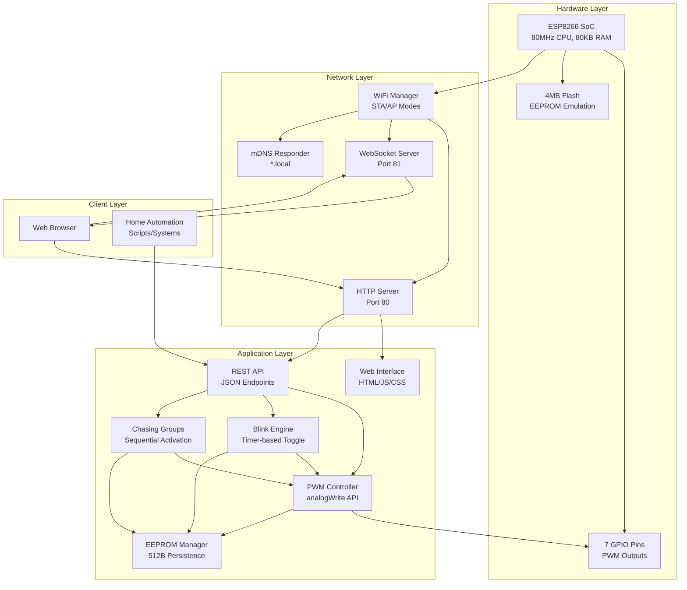
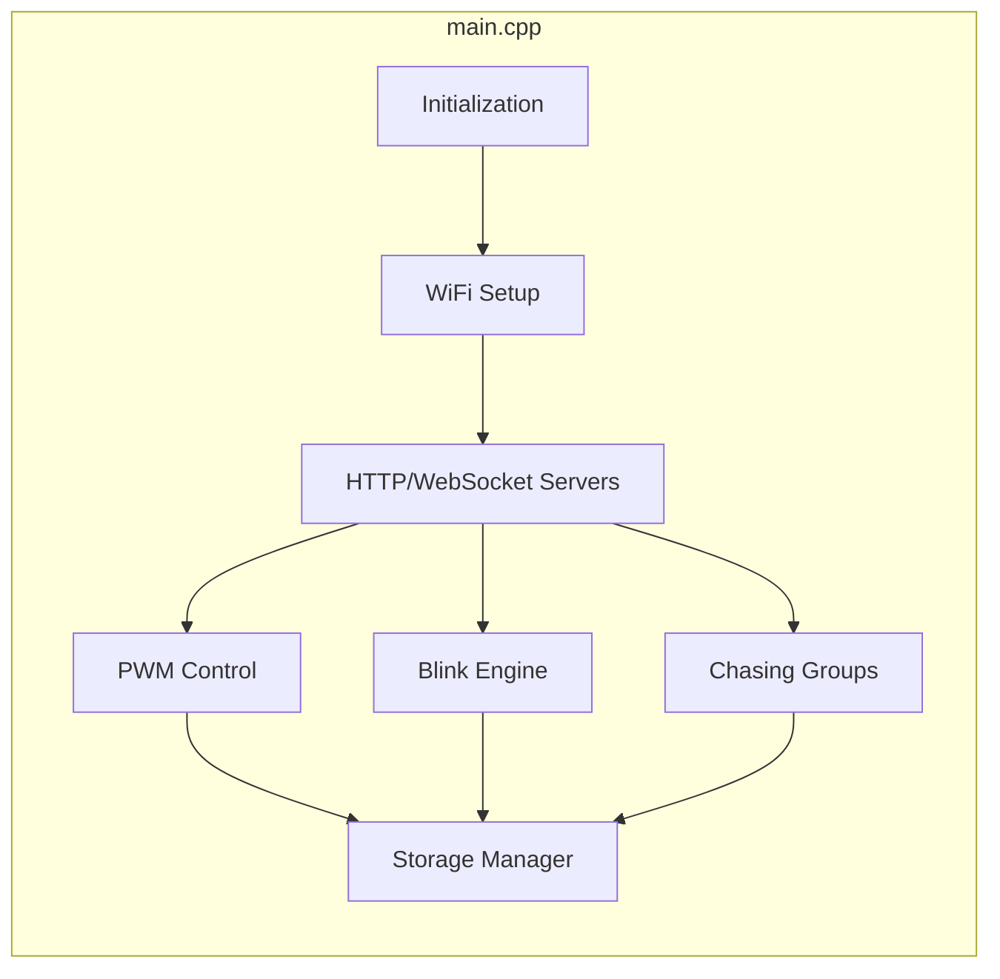

<div align="center">

# 🚂 RailHub8266 Firmware

### ESP8266-Based WiFi Controller for Model Railways & Lighting

[](https://github.com/Mark-Ortner-NRW/RailHub8266-Firmware/releases)
[](https://www.espressif.com/en/products/socs/esp8266)
[](https://platformio.org/)
[](https://www.arduino.cc/)
[](LICENSE)
[](https://github.com/Mark-Ortner-NRW/RailHub8266-Firmware)

**7 PWM Outputs • Real-Time WebSocket • Chasing Groups • REST API**

[Features](#-features) •
[Quick Start](#-quick-start) •
[Documentation](#-documentation) •
[API Reference](#-api-reference) •
[Contributing](#-contributing)

</div>

---

## 📋 Table of Contents

- [Overview](#-overview)
- [Features](#-features)
- [Architecture](#-architecture)
- [Screenshots](#-screenshots)
- [Hardware Requirements](#-hardware-requirements)
- [Pin Configuration](#-pin-configuration)
- [Quick Start](#-quick-start)
- [Installation](#-installation)
- [Usage](#-usage)
- [Configuration](#-configuration)
- [API Reference](#-api-reference)
- [Web Interface](#-web-interface)
- [Chasing Light Groups](#-chasing-light-groups)
- [Development](#-development)
- [Build & Test](#-build--test)
- [Troubleshooting](#-troubleshooting)
- [Roadmap](#-roadmap)
- [Changelog](#-changelog)
- [License](#-license)
- [Acknowledgements](#-acknowledgements)

---

## 📖 Overview

**RailHub8266** is a WiFi-enabled PWM output controller built on the ESP8266 platform, designed for model railway lighting, accessories, and general-purpose automation. It provides **7 PWM outputs** with individual brightness control, **real-time WebSocket updates**, **chasing light groups** (exclusive to ESP8266 version), and a responsive multilingual web interface.

### Key Highlights

- 🎯 **7 Independent PWM Outputs** - GPIO 4, 5, 12, 13, 14, 16, 2
- 📡 **WebSocket Real-Time Updates** - Broadcasts status every 500ms
- 🌈 **Chasing Light Groups** - Up to 4 sequential lighting effects (ESP8266-exclusive feature)
- ⏱️ **Blink Intervals** - Per-output configurable blinking (0-65535ms)
- 📶 **WiFiManager Portal** - Easy WiFi setup via captive portal
- 💾 **EEPROM Persistence** - All settings saved across power cycles
- 🌐 **Responsive Web UI** - Mobile-friendly interface in 6 languages
- 🔌 **RESTful API** - Complete HTTP API for automation integration
- 🏠 **mDNS Support** - Access via `railhub8266.local`

> **⚡ ESP8266-Exclusive:** Chasing light groups are ONLY available on the ESP8266 version!

---

## ✨ Features

### Core Functionality

| Feature | Description |
|---------|-------------|
| 🎛️ **7 PWM Outputs** | Individual on/off states and brightness (0-100%) |
| 📡 **WebSocket Server** | Real-time bidirectional communication on port 81 |
| 🌈 **Chasing Groups** | Up to 4 sequential chasing effects with configurable timing |
| ⏱️ **Blink Control** | Individual blink rates per output (0-65535ms intervals) |
| 📶 **WiFi Connectivity** | Connect to existing network or standalone AP mode |
| 🌐 **Web Interface** | Responsive multilingual control panel (English, German, French, Italian, Chinese, Hindi) |
| 💾 **EEPROM Storage** | Persistent settings, intervals, output names, and chasing groups |
| 🔧 **WiFiManager** | Captive portal for easy WiFi configuration |
| 🏠 **mDNS Discovery** | Access device via `railhub8266.local` |
| ✏️ **Custom Naming** | Assign meaningful names to outputs (up to 20 characters) |
| 🔌 **REST API** | Complete HTTP API for home automation and scripting |
| 💡 **Status LED** | Visual feedback on GPIO 2 (built-in LED) |

### ESP8266-Specific Advantages

- **Chasing Light Groups**: Create dynamic sequential lighting effects (traffic lights, runway lights, advertising signs)
- **Low Power Consumption**: Efficient for always-on installations
- **Compact Form Factor**: Compatible with NodeMCU, Wemos D1 Mini, ESP-12E modules
- **Cost-Effective**: Affordable solution for model railway automation

---

## 🏗️ Architecture

RailHub8266 follows a **single-file architecture** optimized for ESP8266's memory constraints:



### Component Overview

- **WiFi Manager**: Handles network connectivity with captive portal for easy setup
- **HTTP Server**: Serves web interface and REST API endpoints (port 80)
- **WebSocket Server**: Broadcasts real-time status updates every 500ms (port 81)
- **PWM Controller**: Manages 7 GPIO outputs with 8-bit brightness resolution
- **Blink Engine**: Timer-based output toggling with per-output intervals
- **Chasing Groups Engine**: Sequential activation of outputs in configured groups
- **EEPROM Manager**: Persistent storage of configuration in flash memory (512 bytes)
- **mDNS Responder**: Enables hostname-based access (`railhub8266.local`)

For detailed architecture documentation, see the [arc42 documentation](arc42/README.md).

---

## 📸 Screenshots

<div align="center">

<table>
<tr>
<td align="center">

<br/>
<b>Main Control Panel</b>
<br/>
<em>Real-time status and output control</em>
</td>
<td align="center">

<br/>
<b>PWM Output Control</b>
<br/>
<em>Brightness sliders and blink intervals</em>
</td>
<td align="center">

<br/>
<b>Settings & Configuration</b>
<br/>
<em>Device naming and WiFi management</em>
</td>
</tr>
</table>

</div>

---

## 🛠️ Hardware Requirements

### Required Components

| Component | Specification | Notes |
|-----------|---------------|-------|
| **ESP8266 Board** | ESP-12E, NodeMCU, Wemos D1 Mini | 4MB flash recommended |
| **Power Supply** | 3.3V or 5V (USB) | ≥500mA current capacity |
| **PWM Devices** | LEDs, Motors, Servos, Relays | Up to 7 devices |

### Optional Components

| Component | Purpose |
|-----------|---------|
| **Button (GPIO 0)** | WiFi configuration portal trigger |
| **Status LED (GPIO 2)** | Visual feedback (built-in on most boards) |
| **MOSFETs** | High-current load switching (>12mA) |
| **Level Shifters** | 5V device interfacing (if needed) |

### Supported ESP8266 Boards

- ✅ **ESP-12E** - Bare module (requires USB-UART adapter)
- ✅ **NodeMCU v1.0** - Development board with USB
- ✅ **Wemos D1 Mini** - Compact form factor
- ✅ **Generic ESP8266** - 4MB flash minimum

---

## 📌 Pin Configuration

### PWM Output Mapping

| Output # | GPIO | NodeMCU Label | Wemos D1 Label | Safe for PWM | Notes |
|----------|------|---------------|----------------|--------------|-------|
| **1** | 4 | D2 | D2 | ✅ | Recommended |
| **2** | 5 | D1 | D1 | ✅ | Recommended |
| **3** | 12 | D6 | D6 | ✅ | Recommended |
| **4** | 13 | D7 | D7 | ✅ | Recommended |
| **5** | 14 | D5 | D5 | ✅ | Recommended |
| **6** | 16 | D0 | D0 | ⚠️ | No pull-up, wake pin |
| **7** | 2 | D4 | D4 | ⚠️ | Boot mode, built-in LED |

### Special Function Pins

| Pin | Function | Description |
|-----|----------|-------------|
| **GPIO 2** | Status LED | Active LOW (LED on when pin LOW) |
| **GPIO 0** | Config Portal | Hold LOW for 3 seconds to trigger WiFi setup |

### PWM Characteristics

- **Frequency**: 1kHz (1000 Hz)
- **Resolution**: 8-bit (0-255 range)
- **API Call**: `analogWrite(pin, 0-255)`
- **Max Current**: 12mA per pin (use MOSFETs for higher loads)

### Pin Warnings

⚠️ **GPIO 0, 2, 15** - Boot mode pins. Avoid external pull-ups/pull-downs that interfere with boot sequence.

⚠️ **GPIO 16** - No internal pull-up resistor. Use external pull-up if needed.

⚠️ **Voltage Level** - ESP8266 is a **3.3V device**. Do NOT apply 5V to GPIO pins.

---

## 🚀 Quick Start

### 1. Clone Repository

```bash
git clone https://github.com/Mark-Ortner-NRW/RailHub8266-Firmware.git
cd RailHub8266-Firmware
```

### 2. Install PlatformIO

**Option A: VS Code Extension**
```bash
# Install VS Code PlatformIO IDE extension
code --install-extension platformio.platformio-ide
```

**Option B: Command Line**
```bash
pip install platformio
```

### 3. Build & Flash

```bash
# Build firmware
pio run -e esp12e

# Upload to device (adjust COM port in platformio.ini)
pio run -e esp12e --target upload

# Monitor serial output
pio device monitor -b 115200
```

### 4. Connect to WiFi

On first boot:
1. Device creates AP: **`RailHub8266-Setup`** (password: `12345678`)
2. Connect to AP and navigate to `192.168.4.1`
3. Enter your WiFi credentials
4. Device reboots and connects to your network

### 5. Access Web Interface

- **Via mDNS**: `http://railhub8266.local`
- **Via IP**: Check serial monitor for assigned IP address

---

## 📦 Installation

### Prerequisites

- **PlatformIO Core** (CLI) or **PlatformIO IDE** (VS Code extension)
- **USB-UART Driver** (CH340, CP2102, FTDI) for your ESP8266 board
- **Git** (for cloning repository)

### Detailed Steps

1. **Clone the repository**:
   ```bash
   git clone https://github.com/Mark-Ortner-NRW/RailHub8266-Firmware.git
   cd RailHub8266-Firmware
   ```

2. **Configure upload port** (optional):
   Edit `platformio.ini`:
   ```ini
   upload_port = COM6  ; Windows
   ; upload_port = /dev/ttyUSB0  ; Linux
   ; upload_port = /dev/cu.usbserial-*  ; macOS
   ```

3. **Build the project**:
   ```bash
   pio run -e esp12e
   ```

4. **Flash to device**:
   ```bash
   pio run -e esp12e --target upload
   ```

5. **Monitor serial output** (optional):
   ```bash
   pio device monitor -b 115200
   ```

### Build Environments

The `platformio.ini` defines three environments:

| Environment | Purpose | Use Case |
|-------------|---------|----------|
| **esp12e** | Hardware build for ESP-12E | Production firmware |
| **native** | Native x86 build | Local testing (limited functionality) |
| **esp12e_test** | Hardware build with tests | Unit testing with Unity framework |

---

## 💡 Usage

### Initial Configuration

1. **Flash Firmware** to ESP8266 board
2. **Configure WiFi**:
   - Device creates AP: `RailHub8266-Setup` (password: `12345678`)
   - Connect and navigate to `192.168.4.1`
   - Enter WiFi credentials
   - Device reboots and connects
3. **Access Web Interface**:
   - mDNS: `http://railhub8266.local`
   - Direct IP: Check serial monitor
4. **Test Outputs**: Set custom names and verify each output

### Basic Operations

#### Control Output via Web Interface

1. Navigate to **Control** tab
2. Toggle output ON/OFF
3. Adjust brightness slider (0-100%)
4. Set blink interval (0 = no blink, 1-65535ms)

#### Create Chasing Light Group

1. Navigate to **Chasing** tab
2. Click **Create New Group**
3. Select outputs in desired sequence
4. Set step interval (e.g., 300ms)
5. Assign group name (e.g., "Runway Lights")
6. Click **Save**

#### Customize Output Names

1. Navigate to **Settings** tab
2. Enter custom name for each output (max 20 characters)
3. Examples: "Platform Lights", "Signal Tower", "Station Entrance"
4. Click **Save**

---

## ⚙️ Configuration

### WiFiManager Configuration Portal

**Access Methods:**

1. **First Boot**: Automatically creates AP if no WiFi credentials saved
2. **Manual Trigger**: Hold GPIO 0 button for 3 seconds
3. **Web Interface**: Click "Reset WiFi" in Settings tab

**Portal Details:**

- **SSID**: `RailHub8266-Setup`
- **Password**: `12345678`
- **Portal IP**: `192.168.4.1`
- **Timeout**: 180 seconds (auto-closes after 3 minutes of inactivity)

### EEPROM Data Structure

RailHub8266 stores configuration in 512 bytes of EEPROM-emulated flash:

```cpp
struct EEPROMData {
    char deviceName[40];           // Custom device name (39 chars + null)
    bool outputStates[7];          // Output on/off states
    uint8_t outputBrightness[7];   // Brightness values (0-255)
    char outputNames[7][21];       // Custom names (20 chars + null per output)
    uint16_t outputIntervals[7];   // Blink intervals (ms, 0 = disabled)
    uint8_t chasingGroupCount;     // Active chasing groups (0-4)
    struct {
        uint8_t groupId;           // Group ID (0-3)
        bool active;               // Enabled/disabled
        char name[21];             // Group name (20 chars + null)
        uint8_t outputIndices[8];  // Output sequence
        uint8_t outputCount;       // Number of outputs in group
        uint16_t interval;         // Step interval (ms)
    } chasingGroups[4];            // Up to 4 groups
    uint8_t checksum;              // Data integrity verification
};
```

**Total Usage**: ~500 bytes (512 bytes allocated)

### Environment Variables

No environment variables required. All configuration is stored in EEPROM.

---

## 🔌 API Reference

### Base URL

```
http://railhub8266.local/api/
```

### HTTP Endpoints

#### GET `/api/status`

Get current status of all outputs, system info, and chasing groups.

**Response:**
```json
{
  "outputs": [
    {
      "pin": 4,
      "active": true,
      "brightness": 75,
      "interval": 0,
      "name": "Platform Lights"
    }
  ],
  "chasingGroups": [
    {
      "groupId": 0,
      "name": "Runway Lights",
      "outputs": [0, 1, 2, 3],
      "interval": 300,
      "active": true
    }
  ],
  "system": {
    "deviceName": "RailHub8266",
    "uptime": 3600,
    "freeHeap": 32768,
    "wifiSignal": -45,
    "ipAddress": "192.168.1.100"
  }
}
```

#### POST `/api/control`

Control output state and brightness.

**Request:**
```json
{
  "pin": 4,
  "active": true,
  "brightness": 75
}
```

**Response:**
```json
{
  "success": true,
  "message": "Output 4 set to 75% brightness"
}
```

#### POST `/api/interval`

Set blink interval for an output.

**Request:**
```json
{
  "pin": 4,
  "interval": 500
}
```

**Parameters:**
- `interval`: 0 = no blink, 1-65535 = interval in milliseconds

#### POST `/api/name`

Set custom name for an output.

**Request:**
```json
{
  "output": 0,
  "name": "Platform Lights"
}
```

**Parameters:**
- `output`: Output index (0-6)
- `name`: Custom name (max 20 characters)

#### POST `/api/chasing/create`

Create a new chasing light group.

**Request:**
```json
{
  "groupId": 0,
  "outputs": [0, 1, 2, 3],
  "interval": 300,
  "name": "Runway Lights"
}
```

**Parameters:**
- `groupId`: 0-3 (up to 4 groups)
- `outputs`: Array of output indices (0-6)
- `interval`: Step interval in milliseconds (≥50ms)
- `name`: Group name (max 20 characters)

#### POST `/api/chasing/delete`

Delete a chasing light group.

**Request:**
```json
{
  "groupId": 0
}
```

#### POST `/api/chasing/name`

Rename a chasing light group.

**Request:**
```json
{
  "groupId": 0,
  "name": "New Name"
}
```

#### POST `/api/reset`

Clear all EEPROM settings (factory reset).

**Request:** Empty body

**Response:**
```json
{
  "success": true,
  "message": "All settings cleared. Device will reboot."
}
```

### WebSocket Endpoint

**URL:** `ws://railhub8266.local:81/`

**Features:**
- Real-time status broadcasts every 500ms
- Automatic updates on any output/group change
- JSON format identical to `/api/status`

**Example (JavaScript):**
```javascript
const ws = new WebSocket('ws://192.168.1.100:81/');

ws.onmessage = (event) => {
  const status = JSON.parse(event.data);
  console.log('Outputs:', status.outputs);
  console.log('Chasing Groups:', status.chasingGroups);
};
```

### API Examples

#### cURL

```bash
# Turn on Output 1 at 75% brightness
curl -X POST http://railhub8266.local/api/control \
  -H "Content-Type: application/json" \
  -d '{"pin":4,"active":true,"brightness":75}'

# Set 500ms blink interval
curl -X POST http://railhub8266.local/api/interval \
  -H "Content-Type: application/json" \
  -d '{"pin":4,"interval":500}'

# Create chasing group
curl -X POST http://railhub8266.local/api/chasing/create \
  -H "Content-Type: application/json" \
  -d '{"groupId":0,"outputs":[0,1,2,3],"interval":300,"name":"Runway"}'

# Get status
curl http://railhub8266.local/api/status
```

#### Python

```python
import requests

base_url = "http://railhub8266.local/api"

# Control output
requests.post(f"{base_url}/control", json={
    "pin": 4,
    "active": True,
    "brightness": 75
})

# Create chasing group
requests.post(f"{base_url}/chasing/create", json={
    "groupId": 0,
    "outputs": [0, 1, 2, 3],
    "interval": 300,
    "name": "Runway Lights"
})

# Get status
status = requests.get(f"{base_url}/status").json()
print(status)
```

#### Home Assistant (YAML)

```yaml
# configuration.yaml
rest_command:
  railhub_control:
    url: "http://railhub8266.local/api/control"
    method: POST
    headers:
      Content-Type: application/json
    payload: '{"pin":{{ pin }},"active":{{ active }},"brightness":{{ brightness }}}'

sensor:
  - platform: rest
    resource: http://railhub8266.local/api/status
    name: RailHub8266 Status
    json_attributes_path: "$.outputs[0]"
    json_attributes:
      - active
      - brightness
      - name
    value_template: '{{ value_json.system.uptime }}'
    scan_interval: 5
```

---

## 🌐 Web Interface

### Interface Features

- **Status Tab**: Real-time system information
  - WiFi signal strength (dBm)
  - IP address and MAC address
  - Uptime (hh:mm:ss)
  - Free heap memory
  - Flash usage
  
- **Control Tab**: Output management
  - Individual ON/OFF toggles
  - Brightness sliders (0-100%)
  - Blink interval inputs (ms)
  - Custom output names
  
- **Chasing Tab**: Sequential lighting effects
  - Create/delete chasing groups
  - Configure output sequence
  - Set step intervals
  - Group naming
  
- **Settings Tab**: Device configuration
  - WiFi reconnection
  - Device naming
  - Factory reset
  - Language selection

### Supported Languages

- 🇬🇧 English
- 🇩🇪 German (Deutsch)
- 🇫🇷 French (Français)
- 🇮🇹 Italian (Italiano)
- 🇨🇳 Chinese (中文)
- 🇮🇳 Hindi (हिन्दी)

### Real-Time Updates

- **WebSocket Port**: 81
- **Broadcast Interval**: 500ms
- **Auto-Reconnect**: Enabled
- **Instant Feedback**: Changes reflected across all connected clients

---

## 🌈 Chasing Light Groups

### Overview

Chasing light groups create sequential lighting effects by activating outputs in a defined order with configurable timing. This feature is **exclusive to the ESP8266 version**.

### Features

- ✅ Up to **4 independent groups**
- ✅ Up to **8 outputs per group**
- ✅ Configurable **step interval** (50-65535ms)
- ✅ **Custom group names** (persistent)
- ✅ **Sequential activation** (output 1 → 2 → 3 → loop)
- ✅ **Independent from manual control**
- ✅ **Persistent storage** in EEPROM

### Use Cases

| Application | Example Configuration |
|-------------|----------------------|
| **Runway Lights** | 8 outputs, 200ms interval, sequential approach lighting |
| **Traffic Signals** | 3 outputs (red, yellow, green), 2000ms interval |
| **Advertising Signs** | 6 outputs, 500ms interval, attention-grabbing patterns |
| **Warning Lights** | 4 outputs, 300ms interval, safety indication |
| **Decorative Effects** | Variable outputs, custom timing, aesthetic displays |

### Configuration Example

```json
{
  "groupId": 0,
  "name": "Runway Approach",
  "outputs": [0, 1, 2, 3, 4, 5, 6],
  "interval": 200
}
```

This creates a sequential effect: Output 0 → Output 1 → Output 2 → ... → Output 6 → loop

### Behavior

1. Each step activates **one output** and deactivates **previous output**
2. Timing is controlled by **interval** parameter (milliseconds)
3. Loop **automatically restarts** after final output
4. Groups operate **independently** of each other
5. Manual output control **overrides** chasing group temporarily

---

## 👨‍💻 Development

### Repository Structure

```
RailHub8266-Firmware/
├── platformio.ini          # Build configuration
├── README.md               # This file
├── LICENSE                 # Project license
├── arc42/                  # Architecture documentation
│   ├── README.md
│   ├── 01_introduction_and_goals.md
│   ├── 02_architecture_constraints.md
│   ├── ...
│   └── 12_glossary.md
├── include/
│   ├── config.h            # Hardware configuration
│   └── certificates.h      # SSL certificates (optional)
├── src/
│   └── main.cpp            # Main application (~1400 LOC)
├── test/                   # Unit tests (Unity framework)
├── images/                 # Web interface screenshots
└── .gitignore
```

### Code Organization

RailHub8266 uses a **single-file architecture** (`src/main.cpp`) optimized for ESP8266's memory constraints:



### Key Components

- **`initializeOutputs()`**: Configure GPIO pins and PWM
- **`initializeWiFi()`**: WiFiManager setup and connection
- **`initializeWebServer()`**: HTTP routes and handlers
- **`executeOutputCommand()`**: PWM output control
- **`updateBlinkingOutputs()`**: Timer-based blinking logic
- **`updateChasingLightGroups()`**: Sequential chasing logic
- **`saveOutputState()` / `loadOutputStates()`**: EEPROM persistence

### Development Setup

1. **Clone repository**:
   ```bash
   git clone https://github.com/Mark-Ortner-NRW/RailHub8266-Firmware.git
   cd RailHub8266-Firmware
   ```

2. **Install dependencies**:
   ```bash
   pio pkg install
   ```

3. **Configure upload port** in `platformio.ini`:
   ```ini
   upload_port = COM6  ; Adjust to your port
   ```

4. **Build and flash**:
   ```bash
   pio run -e esp12e --target upload
   ```

5. **Monitor serial output**:
   ```bash
   pio device monitor -b 115200
   ```

### Coding Standards

- **Language**: C++ (Arduino framework)
- **Formatting**: 4-space indentation, K&R brace style
- **Naming**: camelCase for functions, UPPER_CASE for constants
- **Comments**: Doxygen-style for functions, inline for complex logic
- **Memory**: Use `F()` macro for string literals to save RAM

### Dependencies

All managed via PlatformIO (`platformio.ini`):

| Library | Version | Purpose |
|---------|---------|---------|
| **ArduinoJson** | ^7.0.4 | JSON parsing and serialization |
| **WiFiManager** | ^2.0.17 | WiFi configuration portal |
| **WebSockets** | ^2.4.1 | WebSocket server for real-time updates |
| **ESP8266WiFi** | Built-in | WiFi connectivity |
| **ESP8266mDNS** | Built-in | Multicast DNS (*.local) |
| **EEPROM** | Built-in | Non-volatile storage |

---

## 🔨 Build & Test

### Build Commands

```bash
# Build for production (ESP-12E)
pio run -e esp12e

# Build for testing (with Unity framework)
pio run -e esp12e_test

# Build for native (x86) testing
pio run -e native

# Clean build
pio run --target clean

# Build verbose
pio run -e esp12e -v
```

### Flash & Monitor

```bash
# Flash to device
pio run -e esp12e --target upload

# Monitor serial output
pio device monitor -b 115200

# Flash and monitor (combined)
pio run -e esp12e --target upload && pio device monitor -b 115200

# Erase flash (full wipe)
esptool.py --port COM6 erase_flash
```

### Testing

```bash
# Run unit tests on hardware
pio test -e esp12e_test

# Run tests on native (limited)
pio test -e native

# Verbose test output
pio test -e esp12e_test -v
```

### Memory Analysis

```bash
# Check memory usage
pio run -e esp12e -t size

# Detailed memory map
pio run -e esp12e -v | grep -A 20 "Memory Usage"
```

**Expected Output:**
```
RAM:   [======    ]  59.0% (used 47KB from 80KB)
Flash: [===       ]  39.2% (used 408KB from 1MB)
```

### Debug Output

Enable debug logging in `platformio.ini`:

```ini
build_flags = 
    -DCORE_DEBUG_LEVEL=3  ; 0=None, 3=Verbose
```

Monitor via serial:
```bash
pio device monitor -b 115200 --filter esp8266_exception_decoder
```

---

## 🔧 Troubleshooting

### WiFi Issues

**Problem**: Device won't connect to WiFi

**Solutions**:
1. Hold GPIO 0 button for 3 seconds to reset credentials
2. Verify 2.4GHz network (ESP8266 doesn't support 5GHz)
3. Check SSID/password for special characters
4. Ensure router DHCP is enabled
5. Check serial monitor for connection errors

---

**Problem**: Can't access `railhub8266.local`

**Solutions**:
1. Use direct IP address (check serial monitor)
2. Verify mDNS support on your OS:
   - Windows: Install Bonjour Print Services
   - macOS: Built-in support
   - Linux: Install `avahi-daemon`
3. Check firewall settings (allow port 5353 UDP)

### Web Interface Issues

**Problem**: Web interface not loading

**Solutions**:
1. Clear browser cache (Ctrl+F5)
2. Try different browser (Chrome, Firefox, Safari)
3. Check console for JavaScript errors
4. Verify device is connected to WiFi
5. Try direct IP instead of mDNS

---

**Problem**: WebSocket not connecting

**Solutions**:
1. Check WebSocket port 81 is not blocked
2. Disable VPN/proxy that may interfere
3. Monitor serial output for WebSocket errors
4. Refresh page to re-establish connection

### Hardware Issues

**Problem**: Outputs not responding

**Solutions**:
1. Verify correct GPIO pin connections (see [Pin Configuration](#-pin-configuration))
2. Check power supply (adequate current for loads)
3. Use MOSFETs for high-current devices (>12mA)
4. Monitor serial output for PWM errors
5. Test individual outputs via web interface

---

**Problem**: Device keeps rebooting

**Solutions**:
1. Check power supply stability (brownout detection)
2. Verify no shorts on GPIO pins
3. Monitor serial for crash dumps
4. Disable watchdog temporarily for debugging
5. Check for memory leaks (heap fragmentation)

### Memory Issues

**Problem**: Low heap warnings in serial monitor

**Solutions**:
1. Limit concurrent WebSocket connections (max 3 clients)
2. Reduce JSON payload size in requests
3. Monitor heap via `/api/status` endpoint
4. Avoid large POST requests (>1KB)

---

**Problem**: EEPROM corruption detected

**Solutions**:
1. Factory reset via `/api/reset` endpoint
2. Re-flash firmware with `erase_flash` option
3. Verify power supply stability during writes
4. Check for excessive EEPROM writes (wear leveling)

### Build Issues

**Problem**: Compilation errors

**Solutions**:
1. Update PlatformIO: `pio upgrade`
2. Clean build: `pio run --target clean`
3. Remove `.pio` folder and rebuild
4. Verify library versions in `platformio.ini`
5. Check for missing dependencies

---

**Problem**: Upload failed

**Solutions**:
1. Verify correct COM port in `platformio.ini`
2. Check USB cable (data cable, not charge-only)
3. Install USB-UART drivers (CH340, CP2102)
4. Hold FLASH button during upload (some boards)
5. Reduce upload speed: `upload_speed = 460800`

### Common Error Messages

| Error | Cause | Solution |
|-------|-------|----------|
| `WiFi connection failed` | Wrong credentials | Reset WiFi via config portal |
| `WebSocket disconnected` | Network instability | Auto-reconnects after 5s |
| `Low heap memory` | Memory leak or too many clients | Restart device, limit clients |
| `EEPROM checksum failed` | Corrupted data | Factory reset via `/api/reset` |
| `GPIO pin conflict` | Invalid pin configuration | Check `config.h` pin assignments |

---

## 🗺️ Roadmap

### Planned Features

- [ ] **HTTPS Support** - Secure WebSocket (wss://) and HTTPS
- [ ] **MQTT Integration** - Publish status updates to MQTT broker
- [ ] **OTA Firmware Updates** - Over-the-air firmware flashing
- [ ] **Advanced Chasing Patterns** - Reverse, bounce, fade effects
- [ ] **Scheduler** - Time-based output control (daily/weekly)
- [ ] **PWM Frequency Control** - Adjustable PWM frequency per output
- [ ] **Authentication** - Optional password protection for web interface
- [ ] **Multi-Device Sync** - Coordinate multiple RailHub8266 devices
- [ ] **REST Webhooks** - Trigger external services on events

### Completed Features (v2.0.0)

- ✅ WebSocket real-time updates (500ms broadcast)
- ✅ Chasing light groups (up to 4 groups)
- ✅ Blink interval control (per-output)
- ✅ Enhanced EEPROM structure
- ✅ Multilingual web interface (6 languages)
- ✅ Custom output naming (20 characters)
- ✅ mDNS support (*.local)

---

## 📜 Changelog

### Version 2.0.0 (2024-11-16)

**Major Features:**
- ✨ Added WebSocket server for real-time updates (port 81, 500ms broadcast)
- ✨ Implemented chasing light groups (up to 4 groups, configurable intervals)
- ✨ Added blink interval control per output (0-65535ms, persistent)
- ✨ Enhanced EEPROM structure for new features (~500 bytes)
- ✨ Improved web interface with live WebSocket updates
- ✨ Full API expansion for chasing lights and intervals

**Improvements:**
- 🔧 Optimized memory usage for ESP8266 constraints
- 🔧 Enhanced error handling and validation
- 🔧 Improved status LED feedback
- 🔧 Better WiFiManager integration

**Bug Fixes:**
- 🐛 Fixed EEPROM checksum validation
- 🐛 Resolved WebSocket disconnect issues
- 🐛 Corrected GPIO 2 LED polarity (active LOW)

---

### Version 1.0.0 (2023-XX-XX)

**Initial Release:**
- ✨ Initial ESP8266 port from RailHub32 controller
- ✨ 7 PWM outputs adapted for ESP8266 GPIO constraints
- ✨ EEPROM storage replacing ESP32 Preferences
- ✨ Optimized for ESP8266 memory limitations (80KB RAM)
- ✨ Full web interface and WiFiManager integration
- ✨ RESTful API for output control
- ✨ mDNS support for easy access
- ✨ Multilingual interface (6 languages)

---

## 📄 License

This project is licensed under the **MIT License**.

```
MIT License

Copyright (c) 2024 Mark Ortner

Permission is hereby granted, free of charge, to any person obtaining a copy
of this software and associated documentation files (the "Software"), to deal
in the Software without restriction, including without limitation the rights
to use, copy, modify, merge, publish, distribute, sublicense, and/or sell
copies of the Software, and to permit persons to whom the Software is
furnished to do so, subject to the following conditions:

The above copyright notice and this permission notice shall be included in all
copies or substantial portions of the Software.

THE SOFTWARE IS PROVIDED "AS IS", WITHOUT WARRANTY OF ANY KIND, EXPRESS OR
IMPLIED, INCLUDING BUT NOT LIMITED TO THE WARRANTIES OF MERCHANTABILITY,
FITNESS FOR A PARTICULAR PURPOSE AND NONINFRINGEMENT. IN NO EVENT SHALL THE
AUTHORS OR COPYRIGHT HOLDERS BE LIABLE FOR ANY CLAIM, DAMAGES OR OTHER
LIABILITY, WHETHER IN AN ACTION OF CONTRACT, TORT OR OTHERWISE, ARISING FROM,
OUT OF OR IN CONNECTION WITH THE SOFTWARE OR THE USE OR OTHER DEALINGS IN THE
SOFTWARE.
```

See [LICENSE](LICENSE) for full text.

---

## 🙏 Acknowledgements

### Credits

- **Original Project**: Ported from [RailHub32](https://github.com/Mark-Ortner-NRW/RailHub32-ESP32-Firmware) ESP32 controller
- **Author**: Mark Ortner (mark_ortner@hotmail.de)
- **Community**: Thanks to all contributors and testers

### Dependencies

Special thanks to the following open-source projects:

- [**ArduinoJson**](https://arduinojson.org/) by Benoit Blanchon - Efficient JSON library
- [**WiFiManager**](https://github.com/tzapu/WiFiManager) by tzapu - Easy WiFi configuration
- [**WebSockets**](https://github.com/Links2004/arduinoWebSockets) by Links2004 - WebSocket server/client
- [**PlatformIO**](https://platformio.org/) - Professional development platform
- [**ESP8266 Arduino Core**](https://github.com/esp8266/Arduino) - Arduino framework for ESP8266

### Tools & Resources

- **ESP8266 Community** - Technical support and documentation
- **PlatformIO Community** - Build system expertise
- **arc42 Template** - Architecture documentation framework

---

## 📞 Support & Contact

### Getting Help

- **Email**: mark_ortner@hotmail.de
- **GitHub Issues**: [Report bugs or request features](https://github.com/Mark-Ortner-NRW/RailHub8266-Firmware/issues)
- **Documentation**: [arc42 Architecture Docs](arc42/README.md)

### Contributing

Contributions are welcome! Please:

1. Fork the repository
2. Create a feature branch (`git checkout -b feature/amazing-feature`)
3. Commit your changes (`git commit -m 'Add amazing feature'`)
4. Push to the branch (`git push origin feature/amazing-feature`)
5. Open a Pull Request

See [CONTRIBUTING.md](CONTRIBUTING.md) for detailed guidelines.

### Related Projects

- [**RailHub32**](https://github.com/Mark-Ortner-NRW/RailHub32-ESP32-Firmware) - ESP32 version (16 outputs, no chasing groups)
- [**RailHub-Docs**](https://github.com/Mark-Ortner-NRW/RailHub-Docs) - Extended documentation and tutorials

---

<div align="center">

**Made with ❤️ for model railway enthusiasts and DIY automation**

[](https://github.com/Mark-Ortner-NRW/RailHub8266-Firmware)
[](https://github.com/Mark-Ortner-NRW/RailHub8266-Firmware/fork)

</div>
