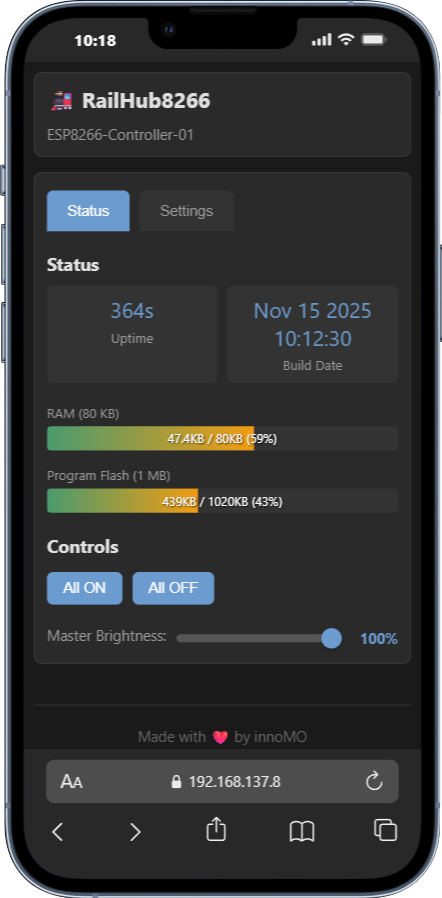

<div align="center">

# 🚂 RailHub8266 Firmware

### ESP8266 Model Railway Control with Chasing Lights

[](https://github.com/Mark-Ortner-NRW/RailHub32-ESP32-Firmware/releases)
[](https://www.espressif.com/en/products/socs/esp8266)
[](https://platformio.org/)
[](../LICENSE)
[](https://github.com/Mark-Ortner-NRW/RailHub32-ESP32-Firmware)

**8 PWM outputs • WebSocket updates • Chasing light groups • WiFi portal**

[Features](#-features) •
[Quick Start](#-building-and-flashing) •
[Chasing Lights](#-chasing-light-groups) •
[API](#-api-reference)


</div>

---

## 📋 Overview

**ESP8266-based WiFi-controlled PWM output controller** for model railways and lighting control. Port of RailHub32 adapted for ESP8266 with 8 outputs, WebSocket real-time updates, **exclusive chasing light groups**, and blink intervals.

> **⚡ Key Advantage:** Chasing light groups are ONLY available on ESP8266 version!

## ✨ Features

<details open>
<summary><b>🎯 Core Functionality</b></summary>
<br>

| Feature | Description |
|---------|-------------|
| 🎛️ **8 PWM Outputs** | Individual on/off states and brightness (0-100%) |
| 📡 **WebSocket Updates** | Real-time status broadcasts every 500ms - no polling |
| 🌈 **Chasing Groups** | Up to 4 sequential chasing effects (ESP8266 EXCLUSIVE) |
| ⏱️ **Blink Control** | Individual blink rates per output (0-65535ms) |
| 📶 **WiFi Portal** | Connect via existing WiFi or standalone AP mode |
| 🌐 **Web Interface** | Responsive multilingual control panel (6 languages) |
| 💾 **EEPROM Storage** | All settings, intervals, and groups saved persistently |
| 🔧 **WiFiManager** | Easy WiFi setup via captive portal |
| 🏠 **mDNS Support** | Access via `railhub8266.local` |
| ✏️ **Custom Names** | Meaningful output labels (persist across reboots) |
| 🔌 **RESTful API** | Complete API for home automation integration |

</details>

<details>
<summary><b>🚨 ESP8266-Exclusive Features</b></summary>
<br>

### 🌟 Chasing Light Groups

**Only available on ESP8266!** Create dynamic sequential lighting effects:

- ✅ Up to 4 independent chasing groups
- ✅ Configurable step intervals (100-10000ms)
- ✅ Custom group names
- ✅ Persistent storage in EEPROM
- ✅ RESTful API control

```json
// Example: Traffic light sequence
{
  "groupId": 0,
  "name": "Traffic Light",
  "outputs": [0, 1, 2],
  "interval": 2000
}
```

</details>

## 🛠️ Hardware Requirements

<table>
<tr>
<td>

### Required Components

- ✅ ESP8266 board
  - ESP-12E
  - NodeMCU
  - Wemos D1 Mini
  - Compatible variants
- ✅ 8 PWM-capable devices
  - LEDs
  - Motors
  - Servos
  - Relays

</td>
<td>

### Optional Components

- 🔘 Push button (GPIO 0)
  - Config portal trigger
- 💡 Built-in LED (GPIO 2)
  - Status indication
- 🔌 Power supply
  - 3.3V or 5V compatible

</td>
</tr>
</table>

## 📌 Pin Configuration

### PWM Output Mapping

<div align="center">

| Output | GPIO | NodeMCU Label | Notes | Status |
|--------|------|---------------|-------|--------|
| 1 | 4 | D2 | Safe for PWM | ✅ |
| 2 | 5 | D1 | Safe for PWM | ✅ |
| 3 | 12 | D6 | Safe for PWM | ✅ |
| 4 | 13 | D7 | Safe for PWM | ✅ |
| 5 | 14 | D5 | Safe for PWM | ✅ |
| 6 | 16 | D0 | No internal pull-up | ⚠️ |
| 7 | 0 | D3 | Boot mode pin | ⚠️ |
| 8 | 2 | D4 | Boot mode pin, LED | ⚠️ |

</div>

### Special Functions

- 💡 **Status LED**: GPIO 2 (D4) - Active LOW (LED on when pin LOW)
- 🔘 **Config Portal**: GPIO 0 (D3) - Hold LOW for 3 seconds

## Platform Differences from ESP32 Version

### ESP8266-Specific Adaptations

1. **PWM Outputs**: 8 outputs vs 16 on ESP32
2. **PWM API**: Uses `analogWrite()` with `analogWriteRange(255)` instead of `ledcWrite()`
3. **Storage**: EEPROM instead of Preferences library
4. **WiFi Library**: `ESP8266WiFi.h` instead of `WiFi.h`
5. **mDNS Library**: `ESP8266mDNS.h` instead of `ESPmDNS.h`
6. **Status LED**: Active LOW on GPIO 2 vs active HIGH on ESP32
7. **Memory**: Limited RAM (80KB) requires careful memory management

### EEPROM Structure

```cpp
struct EEPROMData {
    char deviceName[40];           // Custom device name
    bool outputStates[8];          // On/off states for 8 outputs
    uint8_t outputBrightness[8];   // Brightness values (0-255)
    char outputNames[8][21];       // Custom names (20 chars + null)
    uint16_t outputIntervals[8];   // Blink intervals in ms (0 = no blink)
    // Chasing groups data
    uint8_t chasingGroupCount;     // Number of active groups (0-4)
    struct {
        uint8_t groupId;           // Unique group ID (0-3)
        bool active;               // Group enabled/disabled
        char name[21];             // Group name (20 chars + null)
        uint8_t outputIndices[8];  // Output indices in sequence
        uint8_t outputCount;       // Number of outputs in group
        uint16_t interval;         // Step interval in ms
    } chasingGroups[4];            // Up to 4 chasing groups
    uint8_t checksum;              // Data integrity check
};
```

Total EEPROM usage: ~500 bytes (512 bytes allocated)

## Building and Flashing

### PlatformIO (Recommended)

```bash
# Build for ESP8266 (ESP-12E)
pio run -e esp12e

# Upload to device
pio run -e esp12e --target upload

# Monitor serial output
pio device monitor
```

### Environment Options

The `platformio.ini` defines three environments:

- **esp12e**: Hardware build for ESP-12E module (production)
- **native**: Native x86 build for testing (limited functionality)
- **esp12e_test**: Hardware build with Unity test framework

## Initial Setup

1. **Flash Firmware**: Upload firmware to ESP8266
2. **Connect to WiFi**:
   - On first boot, device creates AP: `RailHub8266-Setup` (password: `12345678`)
   - Connect to AP and configure your WiFi credentials
   - Device reboots and connects to configured network
3. **Access Web Interface**:
   - Via mDNS: `http://railhub8266.local`
   - Via IP: Check serial monitor for assigned IP address
4. **Configure Outputs**: Set custom names and test each output

## Web Interface

The web interface provides:

- **Status Tab**: Real-time system information (WiFi signal, IP, uptime, memory) with live WebSocket updates
- **Control Tab**: Individual output control with brightness sliders and blink interval settings
- **Chasing Tab**: Create and manage up to 4 sequential chasing light groups
- **Settings Tab**: Device configuration and output naming
- **Language Selector**: English, German, French, Italian, Chinese, Hindi

### Interface Screenshots

<div align="center">

<table>
<tr>
<td align="center">

<br/>
<b>Main Control Interface</b>
</td>
<td align="center">

<br/>
<b>Output Control Panel</b>
</td>
<td align="center">

<br/>
<b>Settings & Configuration</b>
</td>
</tr>
</table>

</div>

### Real-Time Updates

- **WebSocket Connection**: Port 81 for live bidirectional communication
- **Broadcast Interval**: 500ms automatic status updates
- **Instant Feedback**: Output changes reflected immediately across all connected clients

### Chasing Light Groups

**Features:**
- Create up to 4 independent chasing groups
- Assign up to 8 outputs per group
- Configurable step interval (10-65535ms)
- Custom group names (persistent)
- Sequential activation (output 1 → 2 → 3... → loop)
- Independent from manual output control

**Use Cases:**
- Runway approach lights
- Advertising signs
- Traffic signals
- Warning lights
- Decorative effects

### API Endpoints

```
GET  /              - Main web interface
GET  /api/status    - JSON status of all outputs, system info, and chasing groups
POST /api/control   - Control output (pin, active, brightness)
POST /api/interval  - Set blink interval (pin, interval in ms)
POST /api/name      - Set custom output name (output, name)
POST /api/chasing/create - Create chasing group (groupId, outputs[], interval, name)
POST /api/chasing/delete - Delete chasing group (groupId)
POST /api/chasing/name   - Rename chasing group (groupId, name)
POST /api/reset     - Clear all saved settings (EEPROM wipe)
```

### WebSocket Endpoint

```
ws://railhub8266.local:81/
```

- Real-time status broadcasts every 500ms
- Automatic updates on any output/group change
- JSON format matching `/api/status`

### Example API Usage

```bash
# Turn on Output 1 at 75% brightness
curl -X POST http://railhub8266.local/api/control \
  -H "Content-Type: application/json" \
  -d '{"pin":4,"active":true,"brightness":191}'

# Set blink interval to 500ms
curl -X POST http://railhub8266.local/api/interval \
  -H "Content-Type: application/json" \
  -d '{"pin":4,"interval":500}'

# Set custom name for Output 1
curl -X POST http://railhub8266.local/api/name \
  -H "Content-Type: application/json" \
  -d '{"output":0,"name":"Platform Lights"}'

# Create chasing light group
curl -X POST http://railhub8266.local/api/chasing/create \
  -H "Content-Type: application/json" \
  -d '{"groupId":0,"outputs":[0,1,2,3],"interval":300,"name":"Runway Lights"}'

# Delete chasing group
curl -X POST http://railhub8266.local/api/chasing/delete \
  -H "Content-Type: application/json" \
  -d '{"groupId":0}'

# Get status (includes chasing groups)
curl http://railhub8266.local/api/status
```

## Configuration Portal

To re-enter WiFi configuration:

1. Press and hold the button on GPIO 0 for 3 seconds
2. Device creates `RailHub8266-Setup` access point
3. Connect and configure new WiFi credentials
4. Device reboots with new settings

Or trigger via web interface Settings tab.

## Memory Usage

- **RAM**: ~59% utilized (47KB/80KB)
- **Flash**: ~39% utilized (408KB/1MB)

The ESP8266's limited RAM requires careful string handling and minimal dynamic allocations.

## Technical Specifications

- **Platform**: Espressif ESP8266
- **Framework**: Arduino
- **Compiler**: GCC 10.3.0 (Xtensa)
- **Flash**: 4MB (1MB program space)
- **RAM**: 80KB
- **PWM Frequency**: 1kHz (default)
- **PWM Resolution**: 8-bit (0-255)

## Dependencies

All dependencies are managed via PlatformIO:

- **ArduinoJson** 7.4.2 - JSON parsing and serialization
- **WiFiManager** 2.0.17 - WiFi configuration portal
- **WebSockets** 2.4.1 - WebSocket server for real-time updates
- **ESP8266WiFi** - WiFi connectivity (built-in)
- **ESP8266mDNS** - Multicast DNS (built-in)
- **EEPROM** - Non-volatile storage (built-in)

## File Structure

```
esp8266-controller/
├── platformio.ini          # Build configuration
├── include/
│   ├── config.h           # Hardware configuration
│   └── certificates.h     # SSL certificates (optional)
├── src/
│   └── main.cpp           # Main application code
├── test/                  # Unit tests (optional)
└── README.md             # This file
```

## Troubleshooting

### Device won't connect to WiFi
- Hold GPIO 0 button for 3 seconds to reset WiFi credentials
- Check SSID/password in configuration portal
- Verify 2.4GHz WiFi network (ESP8266 doesn't support 5GHz)

### Web interface not accessible
- Check serial monitor for IP address
- Try `http://railhub8266.local` (mDNS)
- Ensure device and computer are on same network

### Outputs not responding
- Verify correct GPIO pin connections
- Check power supply (adequate current for loads)
- Monitor serial output for error messages

### High RAM usage warnings
- ESP8266 has only 80KB RAM
- Limit concurrent connections to 2-3 clients
- Avoid large POST requests

## Safety Notes

- **Boot Pins**: GPIO 0, 2, 15 have boot mode constraints. Avoid external pull-ups/pull-downs.
- **Current Limits**: Each GPIO can source/sink max 12mA. Use transistors/MOSFETs for high-current loads.
- **Voltage**: ESP8266 is 3.3V device. Do NOT apply 5V to GPIO pins.
- **Power Supply**: Ensure stable 3.3V supply with adequate current (>250mA).

## License

[Specify your license here]

## Version History

- **2.0.0** - Major feature update
  - Added WebSocket server for real-time updates (port 81, 500ms broadcast)
  - Implemented chasing light groups (up to 4 groups, configurable intervals)
  - Added blink interval control per output (0-65535ms, persistent)
  - Enhanced EEPROM structure for new features
  - Improved web interface with live updates
  - Full API expansion for chasing lights and intervals

- **1.0.0** - Initial ESP8266 port from RailHub32 controller
  - 8 PWM outputs adapted for ESP8266 GPIO constraints
  - EEPROM storage replacing ESP32 Preferences
  - Optimized for ESP8266 memory limitations
  - Full web interface and WiFiManager integration

## Credits

Ported from **RailHub32** ESP32 controller to ESP8266 platform.

## Support

For issues, questions, or contributions, please contact [your contact info].
