# 🚂 RailHub8266 Firmware

> **ESP8266-based WiFi PWM Controller for Model Railways & Decorative Lighting**

[](LICENSE)
[](https://www.espressif.com/en/products/socs/esp8266)
[](https://www.arduino.cc/)
[](https://platformio.org/)
[](https://github.com/Mark-Ortner-NRW/RailHub8266-Firmware)

---

## 📖 Description

**RailHub8266** transforms low-cost ESP8266 microcontrollers into professional WiFi-controlled PWM output controllers. Originally designed for model railway automation and decorative lighting, this firmware provides real-time control via WebSocket connections and a responsive multilingual web interface.

The system is optimized for the ESP8266's memory constraints while adding exclusive features like chasing light groups, making it a cost-effective alternative to the ESP32-based RailHub32.

### Why RailHub8266?

- **💰 Cost-Effective**: ESP8266 modules cost $2-5 (vs. $10-15 for ESP32)
- **📡 WiFi Built-in**: No external network hardware required
- **🎨 7 PWM Outputs**: Individual brightness control (0-100%)
- **⚡ Chasing Light Effects**: Up to 4 sequential lighting groups
- **🌐 Multilingual**: Web UI supports 6 languages (EN, DE, FR, IT, ZH, HI)
- **💾 Persistent State**: All settings survive power loss (EEPROM)
- **🔌 Zero Config**: WiFiManager captive portal for first-time setup
- **📱 Real-Time Updates**: 500ms WebSocket broadcast for instant feedback

---

## ✨ Features

### Core Functionality
- ✅ **7 Independent PWM Outputs** (GPIO 2, 4, 5, 12, 13, 14, 16)
- ✅ **Brightness Control** (0-100%, 8-bit PWM at 1kHz)
- ✅ **Chasing Light Groups** (up to 4 groups, 2-8 outputs each, configurable intervals)
- ✅ **Per-Output Blink Intervals** (0-65535ms)
- ✅ **Custom Output Names** (up to 20 characters, persisted to EEPROM)
- ✅ **WebSocket Real-Time Updates** (500ms broadcast interval)
- ✅ **REST API** for programmatic control
- ✅ **EEPROM Persistence** (state survives power loss)
- ✅ **mDNS Service Discovery** (`railhub8266.local`)

### Network & Configuration
- 🌐 **WiFi Manager** with captive portal (no serial console needed)
- 🔄 **Auto-Reconnect** after network loss
- 🎛️ **Config Portal Trigger** (hold GPIO 0 for 3 seconds)
- 📍 **Static AP Mode** as fallback (SSID: `RailHub8266-AP`)

### User Interface
- 🎨 **Modern Dark Theme** with responsive design
- 🌍 **6 Languages**: English, German, French, Italian, Chinese, Hindi
- 📊 **Real-Time Status Monitoring** (uptime, RAM/Flash usage, WiFi signal)
- 🔧 **Master Brightness Control** (adjust all outputs simultaneously)
- 💡 **Visual State Indicators** (colored borders for ON/Blinking/Chasing states)

---

## 🏗️ Architecture Overview

```mermaid
flowchart TD
    User[👤 User] -->|HTTP/WS| WebServer[ESP8266 Web Server]
    WebServer -->|Control| OutputCtrl[PWM Output Controller]
    WebServer -->|Status| StatusAPI[Status API]
    OutputCtrl -->|Apply| GPIO[7x GPIO Pins]
    OutputCtrl -->|Save| EEPROM[(EEPROM Storage)]
    EEPROM -->|Load on Boot| OutputCtrl
    
    WiFiMgr[WiFiManager] -->|Configure| WebServer
    Portal[Config Portal] -->|On Trigger| WiFiMgr
    
    OutputCtrl -->|Chasing Groups| ChasingCtrl[Chasing Light Controller]
    OutputCtrl -->|Blink Intervals| BlinkCtrl[Blink Controller]
    
    ChasingCtrl -->|Sequential PWM| GPIO
    BlinkCtrl -->|Timed PWM| GPIO
    
    WebSocket[WebSocket Server:81] -->|Broadcast 500ms| WebServer
    mDNS[mDNS Responder] -->|railhub8266.local| WebServer
    
    style User fill:#6c9bcf
    style GPIO fill:#4a9b6f
    style EEPROM fill:#c9a257
```



### Component Breakdown

| Component | Responsibility | Technology |
|-----------|----------------|------------|
| **Web Server** | HTTP endpoints, WebSocket broadcast | `ESP8266WebServer` (port 80) |
| **WebSocket Server** | Real-time bi-directional communication | `WebSocketsServer` (port 81) |
| **PWM Controller** | Manage output states, brightness, intervals | Arduino `analogWrite()` |
| **Chasing Groups** | Sequential light effects (4 groups max) | Custom state machine |
| **EEPROM Manager** | Persist/restore configuration | `EEPROM` library (512 bytes) |
| **WiFiManager** | Captive portal for WiFi setup | `WiFiManager` library |
| **mDNS Responder** | Hostname resolution | `ESP8266mDNS` |

---

## 🛠️ Installation

### Prerequisites

- **Hardware**: ESP8266 module (ESP-12E, NodeMCU, Wemos D1 Mini)
- **Software**: [PlatformIO](https://platformio.org/) (VS Code extension or CLI)
- **Toolchain**: Python 3.x (for PlatformIO)
- **USB Driver**: CP210x or CH340 (depending on your board)

### Quick Start

1. **Clone the Repository**
   ```powershell
   git clone https://github.com/Mark-Ortner-NRW/RailHub8266-Firmware.git
   cd RailHub8266-Firmware
   ```

2. **Open in PlatformIO**
   ```powershell
   code .  # Opens VS Code with PlatformIO extension
   ```

3. **Configure Upload Port** (edit `platformio.ini`)
   ```ini
   upload_port = COM6  # Change to your serial port
   ```

4. **Build & Upload**
   ```powershell
   # Via PlatformIO CLI
   pio run -t upload -t monitor
   
   # Or use PlatformIO IDE:
   # Click "Upload" button in VS Code status bar
   ```

5. **Connect to Config Portal**
   - Device creates AP: `RailHub8266-Setup` (password: `12345678`)
   - Connect and open `http://192.168.4.1`
   - Enter your WiFi credentials
   - Device reboots and connects to your network

6. **Access Web Interface**
   ```
   http://railhub8266.local  # Via mDNS (recommended)
   # OR
   http://<device-ip>        # Check router DHCP leases
   ```

---

## 🎯 Usage Examples

### Basic Control via Web UI

1. **Toggle Output**: Click the switch next to any output
2. **Adjust Brightness**: Drag the slider (applies immediately when output is ON)
3. **Set Blink Interval**: Enter milliseconds (e.g., `500` for 0.5s blink)
4. **Rename Output**: Click the output name → Edit → Save

### Create Chasing Light Group

```text
Settings Tab → Chasing Light Groups
1. Group ID: 1 (unique 1-255)
2. Interval: 500ms (step duration)
3. Select Outputs: Check at least 2 GPIOs
4. Click "Create Group"
```

**Result**: Lights chase sequentially (Output 1 → Output 2 → Output 3 → ...)

### Master Brightness Control

```text
Status Tab → Master Brightness
- Drag slider to apply same brightness to ALL active outputs
- Useful for synchronized dimming
```

---

## ⚙️ Configuration

### WiFi Settings (`include/config.h`)

```cpp
// WiFiManager Configuration Portal
#define WIFIMANAGER_AP_SSID "RailHub8266-Setup"
#define WIFIMANAGER_AP_PASSWORD "12345678"
#define PORTAL_TRIGGER_PIN 0          // GPIO 0 (BOOT button)
#define PORTAL_TRIGGER_DURATION 3000  // Hold 3 seconds to reset WiFi

// Fallback Access Point (if WiFi fails)
#define AP_SSID "RailHub8266-AP"
#define AP_PASSWORD "RailHub8266Pass"
```

### GPIO Pin Mapping (`include/config.h`)

```cpp
// ESP8266 PWM-capable pins (7 outputs)
#define LED_PINS {4, 5, 12, 13, 14, 16, 2}
// Corresponds to NodeMCU: D2, D1, D6, D7, D5, D0, D4

#define STATUS_LED_PIN 2  // Built-in LED (active LOW)
```

### EEPROM Layout

```cpp
struct EEPROMData {
    char deviceName[40];              // Custom device name
    bool outputStates[8];             // ON/OFF states
    uint8_t outputBrightness[8];      // PWM values (0-255)
    char outputNames[8][21];          // Custom names
    uint16_t outputIntervals[8];      // Blink intervals (ms)
    // Chasing groups (4 max)
    uint8_t chasingGroupCount;
    struct {
        uint8_t groupId;
        bool active;
        char name[21];
        uint8_t outputIndices[8];
        uint8_t outputCount;
        uint16_t interval;
    } chasingGroups[4];
    uint8_t checksum;
};
```

**Total Size**: ~450 bytes (of 512 allocated)

---

## 🌐 API Documentation

### REST Endpoints

#### `GET /api/status`
Returns complete system status and output states.

**Response** (JSON):
```json
{
  "macAddress": "AA:BB:CC:DD:EE:FF",
  "name": "ESP8266-Controller-01",
  "wifiMode": "STA",
  "ip": "192.168.1.100",
  "ssid": "MyNetwork",
  "uptime": 123456,
  "freeHeap": 35000,
  "flashUsed": 450000,
  "buildDate": "Nov 16 2025 14:32:10",
  "outputs": [
    {
      "pin": 4,
      "active": true,
      "brightness": 75,
      "name": "Front Light",
      "interval": 0,
      "chasingGroup": -1
    }
  ],
  "chasingGroups": [
    {
      "groupId": 1,
      "name": "Running Lights",
      "interval": 500,
      "outputCount": 3,
      "outputs": [4, 5, 12]
    }
  ]
}
```

#### `POST /api/control`
Control output state and brightness.

**Request**:
```json
{
  "pin": 4,
  "active": true,
  "brightness": 80
}
```

**Response**:
```json
{ "status": "ok" }
```

#### `POST /api/name`
Set custom output name.

**Request**:
```json
{
  "pin": 4,
  "name": "Front Light"
}
```

#### `POST /api/interval`
Set blink interval (0 = disabled).

**Request**:
```json
{
  "pin": 4,
  "interval": 500
}
```

#### `POST /api/chasing/create`
Create chasing light group.

**Request**:
```json
{
  "groupId": 1,
  "interval": 500,
  "outputs": [4, 5, 12],
  "name": "Running Lights"
}
```

#### `POST /api/chasing/delete`
Delete chasing group.

**Request**:
```json
{
  "groupId": 1
}
```

#### `POST /api/reset`
Reset all EEPROM settings to defaults (requires reboot).

---

## 👨‍💻 Development

### Project Structure

```
RailHub8266 Firmware/
├── platformio.ini          # PlatformIO configuration
├── include/
│   └── config.h           # Hardware/WiFi configuration
├── src/
│   └── main.cpp           # Main firmware (~1400 LOC)
├── test/                  # Unit tests (future)
├── arc42/                 # Architecture documentation
│   ├── 01_introduction_and_goals.md
│   ├── 04_solution_strategy.md
│   └── ...
└── README.md              # This file
```

### Build Commands

```powershell
# Build firmware (ESP8266)
pio run -e esp12e

# Upload to device
pio run -e esp12e -t upload

# Open serial monitor (115200 baud)
pio device monitor -b 115200

# Clean build artifacts
pio run -t clean

# Run unit tests (native)
pio test -e native
```

### Development Environment Setup

1. **Install PlatformIO IDE** (VS Code extension)
2. **Install Required Libraries** (auto-installed via `platformio.ini`)
   - `ArduinoJson` 7.0.4
   - `WiFiManager` 2.0.17
   - `WebSockets` 2.4.1

3. **Hardware Connections**
   ```
   ESP8266 Module          Load (LED/Relay)
   ┌───────────┐           ┌──────┐
   │ GPIO 4    ├──────────►│ OUT1 │
   │ GPIO 5    ├──────────►│ OUT2 │
   │ GPIO 12   ├──────────►│ OUT3 │
   │ GPIO 13   ├──────────►│ OUT4 │
   │ GPIO 14   ├──────────►│ OUT5 │
   │ GPIO 16   ├──────────►│ OUT6 │
   │ GPIO 2    ├──────────►│ OUT7 │
   │ GND       ├──────────►│ GND  │
   └───────────┘           └──────┘
   ```

   **Note**: GPIOs drive max 12mA. Use MOSFETs/transistors for higher currents.

### Code Style

- **Indentation**: 4 spaces
- **Naming**: camelCase for functions/variables, UPPER_CASE for macros
- **Comments**: Use `//` for single-line, `/* */` for multi-line
- **Logging**: Prefix serial output with `[MODULE]` (e.g., `[WEB]`, `[EEPROM]`)

Example:
```cpp
void executeOutputCommand(int pin, bool active, int brightnessPercent) {
    Serial.print("[CMD] Output ");
    Serial.print(pin);
    Serial.print(": ");
    Serial.println(active ? "ON" : "OFF");
    // ... implementation
}
```

---

## 🧪 Testing

### Unit Tests (PlatformIO Native)

```powershell
# Run all tests
pio test -e native

# Run specific test
pio test -e native -f test_eeprom
```

### Hardware-in-the-Loop Testing

```powershell
# Build and upload test firmware
pio run -e esp12e_test -t upload

# Monitor test output
pio device monitor -b 115200
```

### Manual Testing Checklist

- [ ] WiFi connection (STA mode)
- [ ] Config portal trigger (hold GPIO 0 for 3s)
- [ ] mDNS hostname resolution (`railhub8266.local`)
- [ ] All 7 outputs toggle ON/OFF
- [ ] Brightness slider (0-100%)
- [ ] Blink interval (500ms test)
- [ ] Chasing group creation (3 outputs)
- [ ] EEPROM persistence (reboot test)
- [ ] WebSocket real-time updates
- [ ] Multilingual UI (6 languages)

---

## 🗺️ Roadmap

### Upcoming Features (v1.1)
- [ ] **OTA Updates**: Web-based firmware upload (if RAM allows)
- [ ] **MQTT Support**: Home Assistant / OpenHAB integration
- [ ] **Scheduler**: Time-based automation rules
- [ ] **PWM Fade Effects**: Smooth transitions (linear/exponential)

### Future Plans (v2.0)
- [ ] **Multi-Device Sync**: Control multiple RailHub8266 units
- [ ] **REST API Authentication**: Basic Auth or API tokens
- [ ] **WebSocket Commands**: Client-initiated control (not just status)
- [ ] **LittleFS Migration**: Replace EEPROM with filesystem (more storage)

---

## 📜 Changelog

### v1.0 (2025-11-16)
- ✅ Initial release
- ✅ 7 PWM outputs with brightness control
- ✅ Chasing light groups (up to 4)
- ✅ Blink intervals (per-output)
- ✅ WiFiManager captive portal
- ✅ WebSocket real-time updates
- ✅ EEPROM persistence
- ✅ Multilingual web UI (6 languages)
- ✅ mDNS service discovery
- ✅ REST API

---

## 📄 License

This project is licensed under the **MIT License**.

```
MIT License

Copyright (c) 2025 Mark Ortner

Permission is hereby granted, free of charge, to any person obtaining a copy
of this software and associated documentation files (the "Software"), to deal
in the Software without restriction, including without limitation the rights
to use, copy, modify, merge, publish, distribute, sublicense, and/or sell
copies of the Software, and to permit persons to whom the Software is
furnished to do so, subject to the following conditions:

The above copyright notice and this permission notice shall be included in all
copies or substantial portions of the Software.

THE SOFTWARE IS PROVIDED "AS IS", WITHOUT WARRANTY OF ANY KIND, EXPRESS OR
IMPLIED, INCLUDING BUT NOT LIMITED TO THE WARRANTIES OF MERCHANTABILITY,
FITNESS FOR A PARTICULAR PURPOSE AND NONINFRINGEMENT. IN NO EVENT SHALL THE
AUTHORS OR COPYRIGHT HOLDERS BE LIABLE FOR ANY CLAIM, DAMAGES OR OTHER
LIABILITY, WHETHER IN AN ACTION OF CONTRACT, TORT OR OTHERWISE, ARISING FROM,
OUT OF OR IN CONNECTION WITH THE SOFTWARE OR THE USE OR OTHER DEALINGS IN THE
SOFTWARE.
```

---

## 🙏 Acknowledgements

### Libraries & Dependencies
- **[Arduino Core for ESP8266](https://github.com/esp8266/Arduino)** - ESP8266 Arduino framework
- **[ArduinoJson](https://arduinojson.org/)** by Benoît Blanchon - JSON serialization
- **[WiFiManager](https://github.com/tzapu/WiFiManager)** by tzapu - Captive portal
- **[WebSockets](https://github.com/Links2004/arduinoWebSockets)** by Links2004 - WebSocket server

### Inspiration
- **RailHub32** (ESP32 version) - Original design concept
- **Model Railway Community** - Feature requests and testing

### Tools
- **[PlatformIO](https://platformio.org/)** - Build system and IDE
- **[arc42](https://arc42.org/)** - Architecture documentation template
- **[Mermaid](https://mermaid.js.org/)** - Diagram generation

---

## 🤝 Contributing

Contributions are welcome! Please follow these steps:

1. **Fork** the repository
2. **Create** a feature branch (`git checkout -b feature/AmazingFeature`)
3. **Commit** your changes (`git commit -m 'Add some AmazingFeature'`)
4. **Push** to the branch (`git push origin feature/AmazingFeature`)
5. **Open** a Pull Request

### Contribution Guidelines
- Follow existing code style (see [Development](#-development))
- Add unit tests for new features
- Update documentation (README + arc42 docs)
- Test on real ESP8266 hardware before submitting

---

## 📞 Contact

**Mark Ortner**  
📧 Email: [mark_ortner@hotmail.de](mailto:mark_ortner@hotmail.de)  
🐙 GitHub: [@Mark-Ortner-NRW](https://github.com/Mark-Ortner-NRW)  
🔗 Project: [RailHub8266-Firmware](https://github.com/Mark-Ortner-NRW/RailHub8266-Firmware)

---

## 🆘 Troubleshooting

### WiFi Connection Issues
**Problem**: Device doesn't connect to WiFi  
**Solution**:
1. Hold GPIO 0 (BOOT button) for 3 seconds
2. Connect to `RailHub8266-Setup` AP (password: `12345678`)
3. Open `http://192.168.4.1` and reconfigure WiFi

### Web Interface Not Loading
**Problem**: `http://railhub8266.local` doesn't work  
**Solution**:
1. Check if your router supports mDNS/Bonjour
2. Use IP address instead (check router DHCP leases)
3. Install [Bonjour Print Services](https://support.apple.com/kb/DL999) on Windows

### Outputs Not Responding
**Problem**: GPIO pins don't change when toggling  
**Solution**:
1. Check physical connections (GPIO → Load → GND)
2. Use serial monitor to verify commands: `pio device monitor -b 115200`
3. Test with LED + 220Ω resistor (GPIO → LED+ → LED- → Resistor → GND)

### Low Free Heap Warning
**Problem**: Serial shows `<20KB free heap`  
**Solution**:
1. Restart device (heap fragmentation is normal over time)
2. Reduce WebSocket client count (limit to 2-3)
3. Check for memory leaks in custom code modifications

### EEPROM Corruption
**Problem**: Settings lost after reboot  
**Solution**:
1. Use `/api/reset` to clear EEPROM
2. Power cycle device
3. Reconfigure via web interface

---

<div align="center">

**Made with ❤️ by [innoMO](https://github.com/Mark-Ortner-NRW)**

⭐ **Star this repo if you find it useful!** ⭐

</div>
