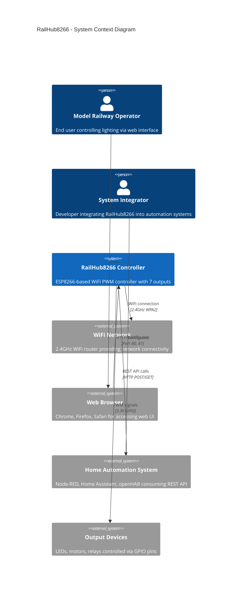
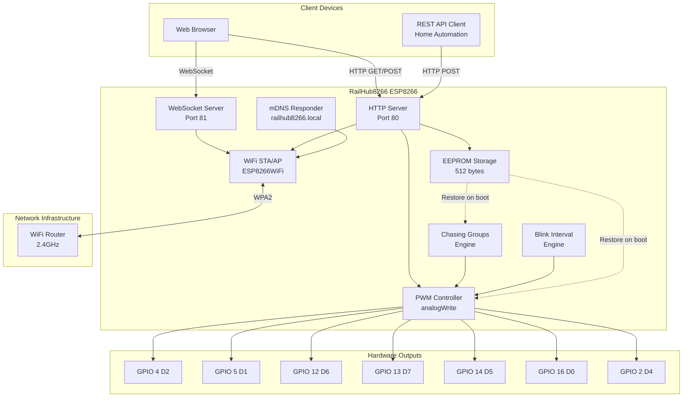

# 3. System Scope and Context

This section defines the boundaries of the RailHub8266 system and describes its external interfaces.

## Business Context

The following diagram shows the RailHub8266 system in its operational context, highlighting the main external actors and systems.



### Legend
- **Person**: Human actors interacting with the system
- **System**: The RailHub8266 firmware and hardware
- **System_Ext**: External systems and devices
- **Rel**: Communication relationships

## External Interfaces

### User Interfaces

| Interface | Type | Description | Access Method |
|-----------|------|-------------|---------------|
| **Web UI** | HTTP/HTML | Responsive web interface for manual control | Browser → `http://railhub8266.local` or `http://<IP>` |
| **WiFiManager Portal** | HTTP/HTML | Captive portal for WiFi configuration | Browser → Connect to `RailHub8266-Setup` AP → `http://192.168.4.1` |
| **Serial Console** | UART | Debug output and boot messages | USB-serial adapter @ 115200 baud |

### Technical Context

The following diagram shows the technical communication channels and protocols.



### Communication Protocols

| Protocol | Port | Direction | Purpose | Data Format |
|----------|------|-----------|---------|-------------|
| **HTTP** | 80 | Bidirectional | Web UI delivery, REST API | HTML, JSON |
| **WebSocket** | 81 | Server→Client | Real-time status broadcasts (500ms interval) | JSON |
| **mDNS** | 5353 | Broadcast | Local service discovery | DNS-SD |
| **WiFi 2.4GHz** | - | Bidirectional | Network connectivity | 802.11 b/g/n |
| **UART** | USB | Output only | Debug logging | ASCII text (115200 baud) |

### Data Interfaces

#### REST API Endpoints

| Endpoint | Method | Request Body (JSON) | Response | Purpose |
|----------|--------|---------------------|----------|---------|
| `/` | GET | - | HTML | Serve web interface |
| `/api/status` | GET | - | JSON (status) | Get system status and output states |
| `/api/control` | POST | `{pin, active, brightness}` | JSON (success) | Control single output |
| `/api/interval` | POST | `{pin, interval}` | JSON (success) | Set blink interval |
| `/api/name` | POST | `{pin, name}` | JSON (success) | Set custom output name |
| `/api/chasing/create` | POST | `{groupId, outputs[], interval, name}` | JSON (success) | Create chasing group |
| `/api/chasing/delete` | POST | `{groupId}` | JSON (success) | Delete chasing group |
| `/api/chasing/name` | POST | `{groupId, name}` | JSON (success) | Rename chasing group |
| `/api/reset` | POST | - | JSON (success) | Clear all EEPROM settings |

#### WebSocket Messages

**Server → Client (broadcast every 500ms)**:
```json
{
  "macAddress": "AA:BB:CC:DD:EE:FF",
  "name": "ESP8266-Controller-01",
  "wifiMode": "STA",
  "ip": "192.168.1.100",
  "ssid": "MyNetwork",
  "freeHeap": 47234,
  "uptime": 3600000,
  "outputs": [
    {
      "pin": 4,
      "active": true,
      "brightness": 75,
      "name": "Platform Lights",
      "interval": 0,
      "chasingGroup": -1
    }
  ],
  "chasingGroups": [
    {
      "groupId": 1,
      "name": "Runway Lights",
      "interval": 300,
      "outputs": [4, 5, 12, 13]
    }
  ]
}
```

### Hardware Interfaces

| GPIO Pin | NodeMCU Label | Function | Signal Type | Notes |
|----------|---------------|----------|-------------|-------|
| GPIO 4 | D2 | Output 1 | PWM (0-255) | Safe for PWM |
| GPIO 5 | D1 | Output 2 | PWM (0-255) | Safe for PWM |
| GPIO 12 | D6 | Output 3 | PWM (0-255) | Safe for PWM |
| GPIO 13 | D7 | Output 4 | PWM (0-255) | Safe for PWM |
| GPIO 14 | D5 | Output 5 | PWM (0-255) | Safe for PWM |
| GPIO 16 | D0 | Output 6 | PWM (0-255) | No internal pull-up |
| GPIO 2 | D4 | Output 7 | PWM (0-255) | Built-in LED (active LOW) |
| GPIO 0 | D3 | Config Portal Trigger | Digital Input (pull-up) | Hold LOW for 3s to trigger portal |

**PWM Characteristics**:
- Frequency: 1kHz
- Resolution: 8-bit (0-255)
- API: `analogWrite(pin, value)`

### EEPROM Storage Structure

```cpp
struct EEPROMData {
    char deviceName[40];           // Custom device name
    bool outputStates[7];          // On/off states
    uint8_t outputBrightness[7];   // Brightness (0-255)
    char outputNames[7][21];       // Custom names (20 chars + null)
    uint16_t outputIntervals[7];   // Blink intervals (ms)
    
    uint8_t chasingGroupCount;     // Active group count (0-4)
    struct {
        uint8_t groupId;           // Group ID (1-255)
        bool active;               // Enabled flag
        char name[21];             // Group name
        uint8_t outputIndices[8];  // Output indices in sequence
        uint8_t outputCount;       // Number of outputs
        uint16_t interval;         // Step interval (ms)
    } chasingGroups[4];
    
    uint8_t checksum;              // Integrity check (unused)
};
```

**Total Size**: ~500 bytes (512 bytes allocated)

## External Dependencies

| Dependency | Version | Purpose | License |
|------------|---------|---------|---------|
| **ArduinoJson** | 7.0.4 | JSON parsing and serialization | MIT |
| **WiFiManager** | 2.0.17 | WiFi configuration portal | MIT |
| **WebSockets** | 2.4.1 | WebSocket server for real-time updates | LGPL 2.1 |
| **ESP8266WiFi** | Built-in | WiFi connectivity | LGPL 2.1 |
| **ESP8266WebServer** | Built-in | HTTP server | LGPL 2.1 |
| **ESP8266mDNS** | Built-in | Multicast DNS | LGPL 2.1 |
| **EEPROM** | Built-in | Non-volatile storage | LGPL 2.1 |

## Assumptions on External Systems

1. **WiFi Router**: Provides stable 2.4GHz WiFi with DHCP server, mDNS forwarding enabled.
2. **Web Browser**: Modern browser (Chrome 90+, Firefox 88+, Safari 14+) with JavaScript and WebSocket support.
3. **Home Automation**: REST API clients must handle HTTP without TLS (plain HTTP).
4. **Power Supply**: External 3.3V regulator provides stable power (>250mA capacity).
5. **Output Loads**: External devices (LEDs, motors) draw <12mA per GPIO or use external transistors/MOSFETs.

---

**Next**: [4. Solution Strategy](04_solution_strategy.md)
