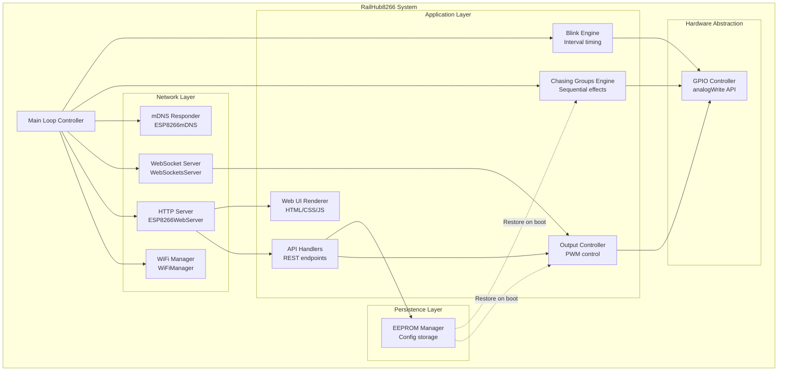

# 5. Building Block View

This section shows the static decomposition of the RailHub8266 system into functional building blocks.

## Level 1: System Overview



### Top-Level Components

| Component | Responsibility | Dependencies |
|-----------|----------------|--------------|
| **Main Loop Controller** | Orchestrates all subsystems, calls `loop()` functions | All components |
| **WiFi Manager** | Manages WiFi connectivity (STA/AP modes), captive portal | ESP8266WiFi, WiFiManager library |
| **HTTP Server** | Serves web UI, handles REST API requests | ESP8266WebServer |
| **WebSocket Server** | Broadcasts status updates to clients (500ms interval) | WebSocketsServer library |
| **mDNS Responder** | Provides local discovery (`railhub8266.local`) | ESP8266mDNS |
| **API Handlers** | Validates and processes REST API requests | Output Controller, EEPROM Manager |
| **Web UI Renderer** | Generates HTML/CSS/JS for browser UI | None (static content) |
| **Output Controller** | Controls individual output states, brightness | GPIO Controller |
| **Chasing Groups Engine** | Implements sequential lighting effects (up to 4 groups) | GPIO Controller |
| **Blink Engine** | Manages per-output blink intervals | GPIO Controller |
| **EEPROM Manager** | Saves/loads configuration to non-volatile storage | EEPROM library |
| **GPIO Controller** | Low-level PWM control via `analogWrite()` | ESP8266 Arduino core |

## Level 2: Component Breakdown

### Network Layer

#### WiFi Manager

**Responsibilities**:
- Establish WiFi connection (STA mode)
- Fallback to AP mode if STA connection fails
- Provide captive portal for WiFi configuration
- Handle WiFi reconnection after network loss

**Interfaces**:
```cpp
void initializeWiFiManager();
void checkConfigPortalTrigger();  // GPIO 0 button handler
```

**Key Variables**:
```cpp
WiFiManager wifiManager;           // Global instance
char customDeviceName[40];         // Custom hostname
bool wifiConnected;                // Connection status flag
```

**Dependencies**:
- `WiFiManager` library (2.0.17)
- `ESP8266WiFi.h`

---

#### HTTP Server

**Responsibilities**:
- Serve HTML web interface (`GET /`)
- Handle REST API requests (`POST /api/*`)
- Send responses in JSON or HTML format

**Interfaces**:
```cpp
void initializeWebServer();
// Endpoint handlers (lambda functions in initializeWebServer)
```

**Key Routes**:
```cpp
server->on("/", HTTP_GET, []() { /* Serve web UI */ });
server->on("/api/status", HTTP_GET, []() { /* JSON status */ });
server->on("/api/control", HTTP_POST, []() { /* Control output */ });
server->on("/api/interval", HTTP_POST, []() { /* Set interval */ });
server->on("/api/name", HTTP_POST, []() { /* Set name */ });
server->on("/api/chasing/create", HTTP_POST, []() { /* Create group */ });
server->on("/api/chasing/delete", HTTP_POST, []() { /* Delete group */ });
server->on("/api/chasing/name", HTTP_POST, []() { /* Rename group */ });
server->on("/api/reset", HTTP_POST, []() { /* Clear EEPROM */ });
```

**Dependencies**:
- `ESP8266WebServer`
- ArduinoJson (for JSON serialization)

---

#### WebSocket Server

**Responsibilities**:
- Accept WebSocket connections on port 81
- Broadcast status JSON to all clients every 500ms
- Handle client connect/disconnect events

**Interfaces**:
```cpp
void wsEvent(uint8_t num, WStype_t type, uint8_t* payload, size_t length);
void broadcastStatus();
```

**Key Variables**:
```cpp
WebSocketsServer* ws;              // Global instance (port 81)
unsigned long lastBroadcast = 0;   // Last broadcast timestamp
const unsigned long BROADCAST_INTERVAL = 500;  // 500ms
```

**Dependencies**:
- `WebSocketsServer` library (links2004)

---

#### mDNS Responder

**Responsibilities**:
- Register mDNS service (`railhub8266.local`)
- Respond to mDNS queries from local network
- Advertise HTTP service on port 80

**Interfaces**:
```cpp
MDNS.begin(hostname);
MDNS.addService("http", "tcp", 80);
MDNS.update();  // Called in main loop
```

**Dependencies**:
- `ESP8266mDNS.h`

---

### Application Layer

#### API Handlers

**Responsibilities**:
- Parse JSON request bodies
- Validate input parameters (pin ranges, brightness values)
- Invoke Output Controller / EEPROM Manager
- Return JSON success/error responses

**Key Functions**:
```cpp
bool deserializeJsonRequest(String body, DynamicJsonDocument& doc, 
                            IPAddress clientIP, const char* endpoint);
```

**Validation Logic**:
- Pin must be valid GPIO (4, 5, 12, 13, 14, 16, 2)
- Brightness: 0-100%
- Interval: 0-65535ms
- Chasing group ID: 1-255
- Chasing interval: ≥50ms

---

#### Web UI Renderer

**Responsibilities**:
- Generate HTML/CSS/JavaScript for web interface
- Deliver content in chunks (memory efficiency)
- Provide multilingual support (6 languages via JavaScript i18n)

**Key Features**:
- Responsive design (mobile-friendly)
- Dark theme UI (railway-themed)
- Real-time WebSocket updates
- Inline SVG favicon (train emoji 🚂)

**Delivery Strategy**:
```cpp
server->setContentLength(CONTENT_LENGTH_UNKNOWN);
server->send(200, "text/html", "");
server->sendContent(F("<html>..."));  // Chunk 1
server->sendContent(F("<style>..."));  // Chunk 2
server->sendContent(F("<script>..."));  // Chunk 3
server->sendContent("");  // End
```

---

#### Output Controller

**Responsibilities**:
- Control individual output state (on/off)
- Set brightness (0-100% → 0-255 PWM)
- Validate pin numbers
- Trigger EEPROM save on state change
- Trigger WebSocket broadcast

**Interfaces**:
```cpp
void executeOutputCommand(int pin, bool active, int brightnessPercent);
int findOutputIndexByPin(int pin);  // Pin → array index lookup
```

**Key Variables**:
```cpp
int outputPins[7] = {4, 5, 12, 13, 14, 16, 2};  // GPIO pins
bool outputStates[7];                // On/off states
int outputBrightness[7];             // PWM values (0-255)
String outputNames[7];               // Custom names
unsigned int outputIntervals[7];    // Blink intervals (ms)
int8_t outputChasingGroup[7];       // Group ownership (-1 = none)
```

---

#### Chasing Groups Engine

**Responsibilities**:
- Manage up to 4 chasing light groups
- Sequential activation of outputs (step every `interval` ms)
- Exclusive ownership of outputs (outputs in groups cannot blink independently)
- Persist groups to EEPROM

**Interfaces**:
```cpp
void createChasingGroup(uint8_t groupId, const uint8_t* outputIndices, 
                        uint8_t count, unsigned int intervalMs, 
                        const char* groupName);
void deleteChasingGroup(uint8_t groupId);
void updateChasingLightGroups();  // Called in main loop
void saveChasingGroups();
void loadChasingGroups();
```

**Data Structure**:
```cpp
struct ChasingGroup {
    uint8_t groupId;              // Unique ID (1-255)
    bool active;                  // Enabled flag
    char name[21];                // Group name (20 chars + null)
    uint8_t outputIndices[8];     // Output indices in sequence
    uint8_t outputCount;          // Number of outputs (max 8)
    uint16_t interval;            // Step interval (ms)
    uint8_t currentStep;          // Current active output index
    unsigned long lastStepTime;   // Last step timestamp
};

ChasingGroup chasingGroups[4];    // Global array
```

**Algorithm**:
```cpp
void updateChasingLightGroups() {
    for (each active group) {
        if (currentTime - lastStepTime >= interval) {
            Turn OFF current output
            Advance to next step (circular)
            Turn ON next output
            Update lastStepTime
        }
    }
}
```

---

#### Blink Engine

**Responsibilities**:
- Toggle outputs at configured intervals (0 = no blink)
- Only affects outputs NOT in chasing groups
- Independent timing per output

**Interfaces**:
```cpp
void setOutputInterval(int index, unsigned int intervalMs);
void updateBlinkingOutputs();  // Called in main loop
```

**Key Variables**:
```cpp
unsigned int outputIntervals[7];   // Blink intervals (0 = disabled)
unsigned long lastBlinkTime[7];    // Last toggle timestamp
bool blinkState[7];                // Current blink state (internal)
```

**Algorithm**:
```cpp
void updateBlinkingOutputs() {
    for (each output NOT in chasing group) {
        if (active && interval > 0) {
            if (currentTime - lastBlinkTime >= interval) {
                Toggle output (PWM ↔ 0)
                Update lastBlinkTime
            }
        }
    }
}
```

---

### Persistence Layer

#### EEPROM Manager

**Responsibilities**:
- Save configuration to EEPROM on every change
- Load configuration on boot
- Manage 512-byte EEPROM structure

**Interfaces**:
```cpp
void saveOutputState(int index);
void saveOutputName(int index, String name);
void saveCustomParameters();
void saveChasingGroups();
void loadOutputStates();
void loadCustomParameters();
void loadChasingGroups();
void saveAllOutputStates();  // Batch save
```

**Data Structure** (see Section 3 for full definition):
```cpp
struct EEPROMData {
    char deviceName[40];
    bool outputStates[7];
    uint8_t outputBrightness[7];
    char outputNames[7][21];
    uint16_t outputIntervals[7];
    uint8_t chasingGroupCount;
    struct { ... } chasingGroups[4];
    uint8_t checksum;
};
```

**Write Strategy**:
1. Read current EEPROM data (`EEPROM.get()`)
2. Update specific field(s)
3. Write entire structure back (`EEPROM.put()`)
4. Commit to flash (`EEPROM.commit()`)

---

### Hardware Abstraction Layer

#### GPIO Controller

**Responsibilities**:
- Set PWM duty cycle via `analogWrite()`
- Configure PWM frequency (1kHz) and range (0-255)

**Interfaces**:
```cpp
void initializeOutputs();
analogWrite(pin, value);  // ESP8266 Arduino core function
```

**Configuration**:
```cpp
analogWriteRange(255);   // 8-bit PWM (0-255)
analogWriteFreq(1000);   // 1kHz PWM frequency
```

**Pin Initialization**:
```cpp
for (int i = 0; i < 7; i++) {
    pinMode(outputPins[i], OUTPUT);
    analogWrite(outputPins[i], 0);  // Start with outputs OFF
}
```

## Level 3: Key Algorithms

### WebSocket Status Broadcast

**Function**: `broadcastStatus()`

**Purpose**: Serialize system status to JSON and broadcast to all WebSocket clients

**Algorithm**:
```cpp
void broadcastStatus() {
    1. Create JSON document (2KB static allocation)
    2. Serialize system info (MAC, IP, uptime, free heap)
    3. Serialize all 7 outputs (pin, state, brightness, name, interval, group)
    4. Serialize all active chasing groups (ID, name, outputs, interval)
    5. Convert JSON to string
    6. ws->broadcastTXT(jsonString)
}
```

**Triggered By**:
- Timer in main loop (every 500ms)
- After any control command (`executeOutputCommand`)
- After creating/deleting chasing group

---

### Chasing Group Step Update

**Function**: `updateChasingLightGroups()`

**Purpose**: Advance chasing groups to next step if interval elapsed

**Algorithm**:
```cpp
void updateChasingLightGroups() {
    unsigned long now = millis();
    
    for (each of 4 group slots) {
        if (group.active && group.outputCount > 0) {
            if (now - group.lastStepTime >= group.interval) {
                // Turn OFF current output
                uint8_t currentIdx = group.outputIndices[group.currentStep];
                analogWrite(outputPins[currentIdx], 0);
                
                // Advance to next step (circular)
                group.currentStep = (group.currentStep + 1) % group.outputCount;
                
                // Turn ON next output
                uint8_t nextIdx = group.outputIndices[group.currentStep];
                analogWrite(outputPins[nextIdx], outputBrightness[nextIdx]);
                
                // Update timestamp
                group.lastStepTime = now;
            }
        }
    }
}
```

---

### EEPROM State Persistence

**Function**: `saveOutputState(int index)`

**Purpose**: Persist single output's state to EEPROM

**Algorithm**:
```cpp
void saveOutputState(int index) {
    1. Read current EEPROM data (EEPROM.get(0, eepromData))
    2. Update fields for this output:
       - eepromData.outputStates[index] = outputStates[index]
       - eepromData.outputBrightness[index] = outputBrightness[index]
       - eepromData.outputIntervals[index] = outputIntervals[index]
    3. Write back entire structure (EEPROM.put(0, eepromData))
    4. Commit to flash (EEPROM.commit())
}
```

**Performance**: ~10-20ms per save (acceptable for infrequent config changes)

---

## Blackbox View

### Main Application Entry Points

```cpp
void setup() {
    Serial.begin(115200);
    EEPROM.begin(512);
    initializeOutputs();
    loadCustomParameters();
    loadOutputStates();
    loadChasingGroups();
    initializeWiFiManager();
    server = new ESP8266WebServer(80);
    initializeWebServer();
    ws = new WebSocketsServer(81);
    ws->begin();
    ws->onEvent(wsEvent);
}

void loop() {
    checkConfigPortalTrigger();
    if (server) server->handleClient();
    if (ws) ws->loop();
    MDNS.update();
    updateChasingLightGroups();
    updateBlinkingOutputs();
    yield();
    
    // WebSocket broadcast (every 500ms)
    if (millis() - lastBroadcast >= 500) {
        broadcastStatus();
        lastBroadcast = millis();
    }
}
```

---

**Next**: [6. Runtime View](06_runtime_view.md)
