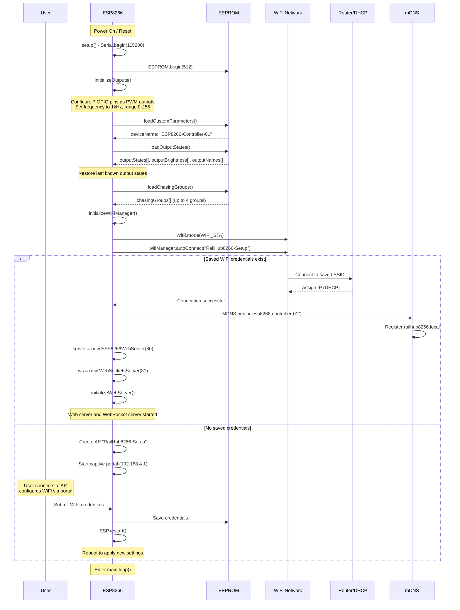
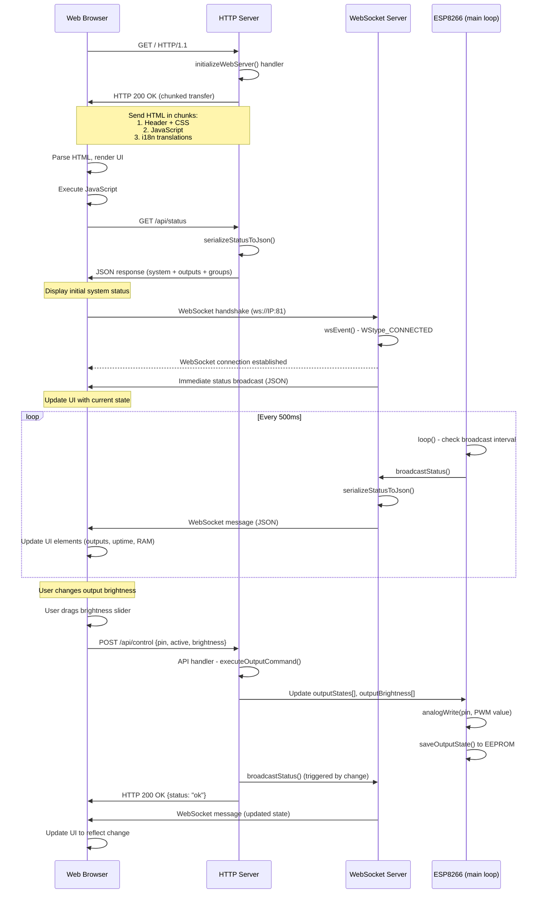
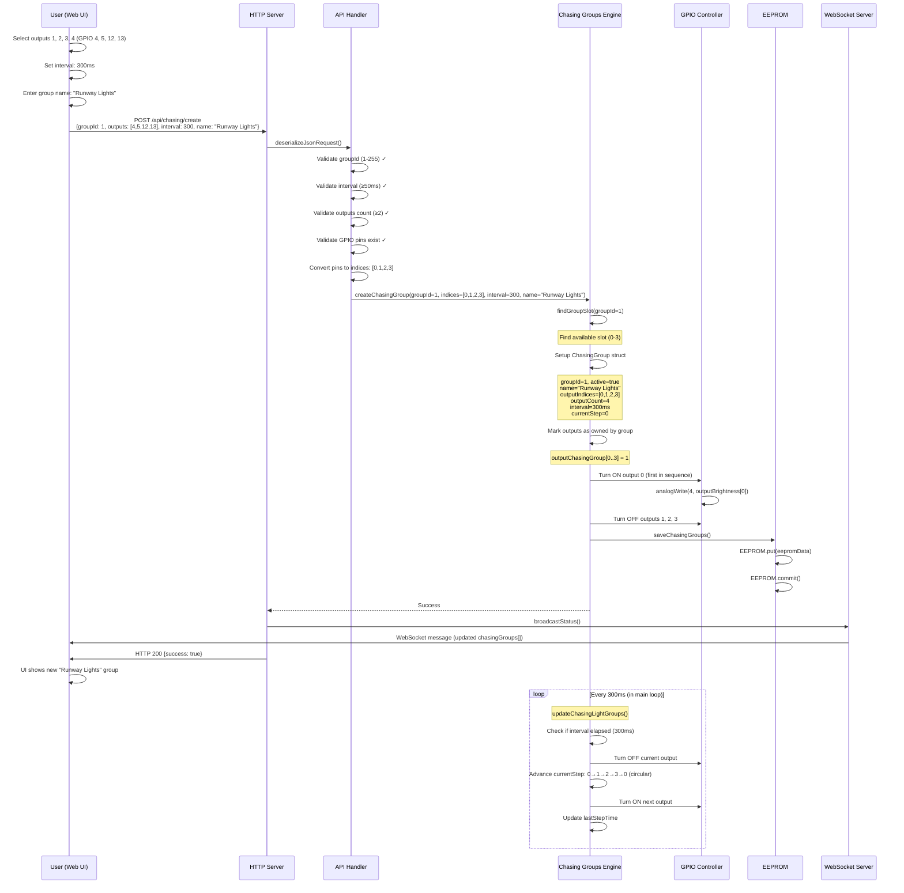
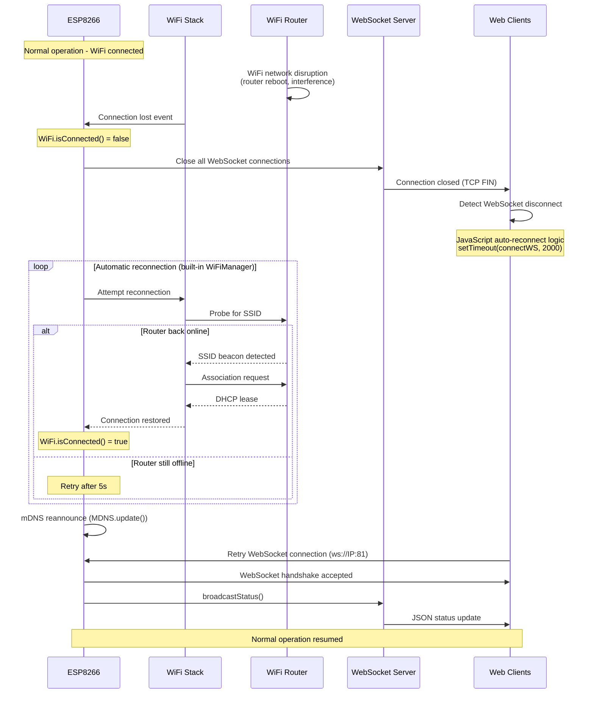
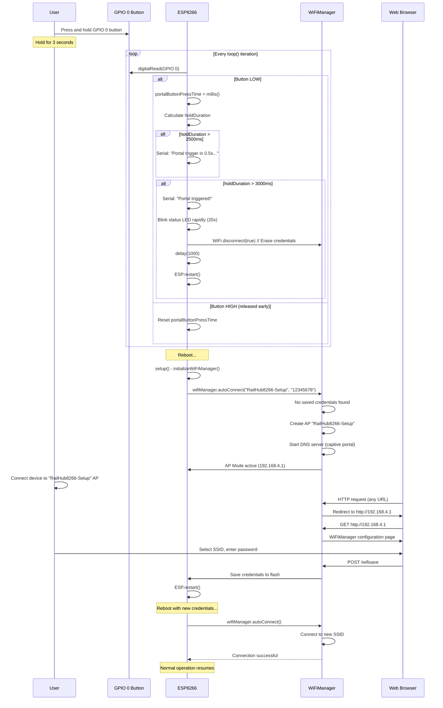

# 6. Runtime View

This section describes the runtime behavior of the RailHub8266 system through important scenarios and use cases.

## Scenario 1: System Boot and Initialization

This scenario shows the complete boot sequence from power-on to ready state.

### Steps

1. **Power-On Reset**: ESP8266 executes bootloader, loads firmware from flash
2. **Serial Initialization**: Opens serial console at 115200 baud for debug output
3. **EEPROM Initialization**: Allocates 512-byte EEPROM buffer in RAM
4. **GPIO Configuration**: Configures 7 output pins with PWM (1kHz, 8-bit)
5. **Load Persistent State**: Restores device name, output states, chasing groups from EEPROM
6. **WiFi Connection**: Attempts connection using saved credentials
7. **Fallback AP Mode**: If no credentials, creates "RailHub8266-Setup" AP with captive portal
8. **Network Services**: Starts HTTP server (port 80), WebSocket server (port 81), mDNS responder
9. **Ready State**: Enters main loop, begins WebSocket broadcasting (500ms interval)

### Performance

- **Typical Boot Time** (with saved WiFi): 3-5 seconds
- **Typical Boot Time** (first boot, AP mode): 2-3 seconds
- **WiFi Connection Time**: 2-8 seconds (depends on router DHCP)

---

## Scenario 2: Web UI Access and Real-Time Updates

This scenario shows a user opening the web interface and receiving real-time updates.

### Steps

1. **Initial Page Load**: Browser requests `/`, receives chunked HTML/CSS/JS
2. **Status Fetch**: JavaScript requests `/api/status`, displays initial state
3. **WebSocket Connection**: Browser opens WebSocket to port 81
4. **Real-Time Broadcast**: WebSocket server sends JSON status every 500ms
5. **User Interaction**: User changes output via UI (e.g., brightness slider)
6. **API Call**: Browser sends POST to `/api/control`
7. **State Update**: ESP updates output, saves to EEPROM, broadcasts to all clients
8. **UI Sync**: Browser receives WebSocket update, refreshes UI

### Performance

- **Initial Page Load**: <2 seconds (chunked delivery, ~40KB HTML)
- **WebSocket Latency**: <100ms round-trip
- **Broadcast Interval**: 500ms (configurable via `BROADCAST_INTERVAL`)

---

## Scenario 3: Creating a Chasing Light Group

This scenario demonstrates creating a sequential chasing effect across 4 outputs.

### Steps

1. **User Input**: User selects outputs, interval, group name via web UI
2. **API Request**: POST to `/api/chasing/create` with group parameters
3. **Validation**: Validate group ID (1-255), interval (≥50ms), outputs (≥2)
4. **Group Creation**: Create `ChasingGroup` struct, assign outputs
5. **Initial State**: Turn ON first output, turn OFF others
6. **Persistence**: Save group to EEPROM
7. **Broadcast**: WebSocket update notifies all clients
8. **Runtime Loop**: Main loop calls `updateChasingLightGroups()` every iteration
9. **Sequential Activation**: Every 300ms, advance to next output in sequence

### Performance

- **API Response Time**: <50ms (validation + group creation)
- **EEPROM Write Time**: ~10-20ms
- **Step Precision**: ±10ms (depends on main loop timing)

---

## Scenario 4: WiFi Connection Loss and Recovery

This scenario shows automatic reconnection after WiFi network disruption.

### Steps

1. **Connection Loss**: WiFi network becomes unavailable (router reboot, interference)
2. **WebSocket Disconnect**: All WebSocket clients disconnected (TCP FIN)
3. **Client Retry Logic**: JavaScript `setTimeout()` retries connection every 2s
4. **ESP Reconnection**: WiFi stack automatically retries connection (built-in behavior)
5. **DHCP Renewal**: Router assigns IP (may be same or different)
6. **mDNS Reannounce**: mDNS responder re-registers `railhub8266.local`
7. **WebSocket Reconnect**: Clients successfully reconnect to port 81
8. **State Sync**: Broadcast resumes, clients receive current state

### Performance

- **Typical Reconnection Time**: 5-15 seconds
- **WebSocket Client Retry**: Every 2 seconds (JavaScript `setTimeout`)
- **No State Loss**: All output states persist in EEPROM, restored on reconnect

---

## Scenario 5: Manual WiFi Configuration via Portal

This scenario shows triggering the WiFiManager portal manually.

### Steps

1. **Button Press**: User holds GPIO 0 button for 3 seconds
2. **Portal Trigger**: ESP detects sustained LOW signal, triggers portal
3. **Credential Erase**: Calls `WiFi.disconnect(true)` to clear saved WiFi settings
4. **Reboot**: ESP restarts to apply changes
5. **AP Mode**: No saved credentials → creates "RailHub8266-Setup" AP
6. **Captive Portal**: User connects, redirected to 192.168.4.1
7. **WiFi Configuration**: User selects SSID, enters password, submits
8. **Save & Reboot**: Credentials saved to flash, ESP restarts
9. **Normal Connection**: ESP connects to new network, starts services

### Performance

- **Portal Trigger Time**: 3 seconds (hold duration)
- **Reboot Time**: ~3-5 seconds
- **AP Creation Time**: ~2 seconds
- **Portal Timeout**: 180 seconds (3 minutes, configurable)

---

**Next**: [7. Deployment View](07_deployment_view.md)
