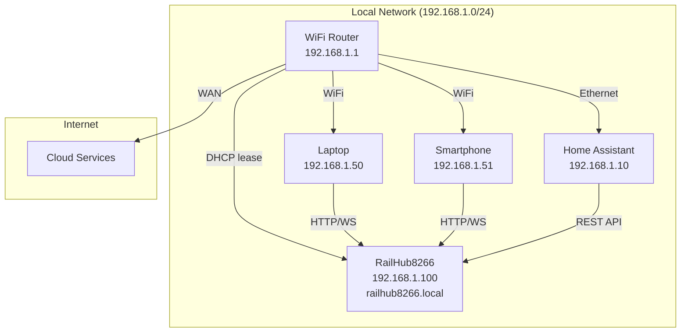
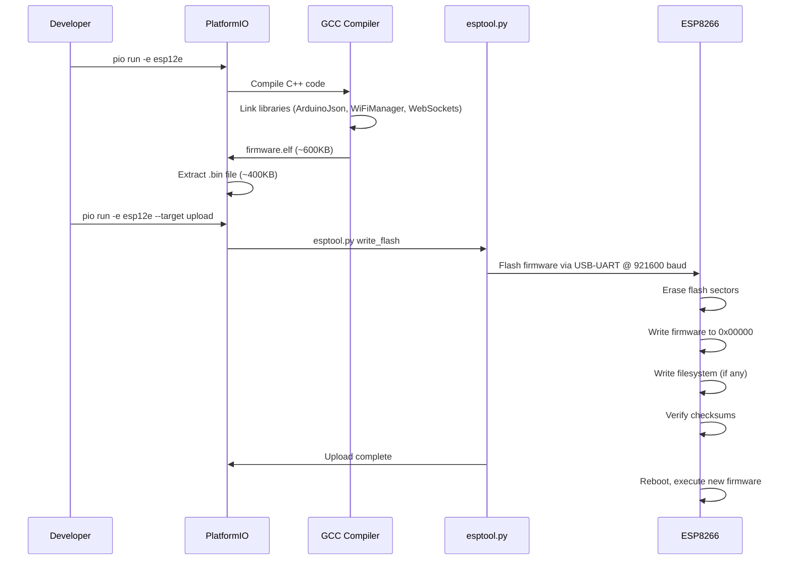

# 7. Deployment View

This section describes the technical infrastructure and hardware deployment of the RailHub8266 system.

## Infrastructure Level 1: System Deployment

```mermaid
C4Deployment
    title RailHub8266 - Deployment Overview

    Deployment_Node(dev_env, "Development Environment", "Windows/macOS/Linux") {
        Container(pio, "PlatformIO", "Build system for compiling and uploading firmware")
        Container(serial, "Serial Monitor", "USB-UART adapter for debug output")
    }
    
    Deployment_Node(network, "Local WiFi Network", "2.4GHz WiFi Router") {
        Container(router, "WiFi Router", "DHCP, DNS, mDNS forwarding")
        
        Deployment_Node(clients, "Client Devices", "Laptops, phones, tablets") {
            Container(browser, "Web Browser", "Chrome, Firefox, Safari")
            Container(automation, "Home Automation", "Node-RED, Home Assistant")
        }
    }
    
    Deployment_Node(hardware, "ESP8266 Device", "NodeMCU / ESP-12E / Wemos D1 Mini") {
        Deployment_Node(mcu, "ESP8266 SoC", "Tensilica L106 @ 80MHz") {
            Container(firmware, "RailHub8266 Firmware", "C++ compiled binary (~400KB)")
            ContainerDb(flash, "Flash Memory", "4MB (1MB program, 3MB unused)")
            ContainerDb(ram, "RAM", "80KB (50KB available)")
            ContainerDb(eeprom_emu, "EEPROM Emulation", "512 bytes in flash")
        }
        
        Container(gpio, "GPIO Pins", "7 PWM outputs (4,5,12,13,14,16,2)")
    }
    
    Deployment_Node(loads, "Output Devices", "LEDs, motors, relays") {
        Container(led1, "LED 1", "Model railway lighting")
        Container(led2, "LED 2-7", "Additional loads")
        Container(mosfet, "MOSFET/Relay", "Optional for high-current loads")
    }
    
    Rel(pio, mcu, "Upload firmware", "USB-UART @ 921600 baud")
    Rel(serial, mcu, "Debug logs", "USB-UART @ 115200 baud")
    
    Rel(mcu, router, "WiFi connection", "802.11 b/g/n @ 2.4GHz")
    Rel(browser, firmware, "HTTP/WebSocket", "Port 80, 81")
    Rel(automation, firmware, "REST API", "HTTP POST/GET")
    
    Rel(firmware, gpio, "PWM signals", "analogWrite()")
    Rel(gpio, led1, "3.3V PWM", "Max 12mA per pin")
    Rel(gpio, mosfet, "3.3V logic", "Gate signal")
    Rel(mosfet, led2, "High current", "Via external power")
    
    UpdateLayoutConfig($c4ShapeInRow="2")
```

## Hardware Platforms

### Supported ESP8266 Modules

| Module | CPU | Flash | RAM | GPIO Pins | USB | Notes |
|--------|-----|-------|-----|-----------|-----|-------|
| **ESP-12E** | 80MHz | 4MB | 80KB | 11 usable | No | Requires USB-UART adapter for programming |
| **NodeMCU v2/v3** | 80MHz | 4MB | 80KB | 11 labeled (D0-D10) | Yes | Built-in USB-UART (CP2102/CH340) |
| **Wemos D1 Mini** | 80MHz | 4MB | 80KB | 11 labeled (D0-D8) | Yes | Compact form factor, USB-C available |
| **Generic ESP8266** | 80MHz | 1-16MB | 80KB | Varies | No | Requires breakout board |

### Recommended Platform

**NodeMCU v3** or **Wemos D1 Mini**
- Built-in USB-UART (no external adapter needed)
- Breadboard-friendly pin headers
- Widely available (~$3-5 USD)
- Good documentation and community support

## Pin Assignment

### GPIO Pin Mapping

```
┌─────────────────────────────────────────┐
│         ESP8266 (NodeMCU v3)            │
│                                         │
│  ┌───────────────────────────────────┐  │
│  │  D0  (GPIO 16) ► Output 6         │  │
│  │  D1  (GPIO  5) ► Output 2         │  │
│  │  D2  (GPIO  4) ► Output 1         │  │
│  │  D3  (GPIO  0) ► Portal Button    │  │
│  │  D4  (GPIO  2) ► Output 7 + LED   │  │
│  │  D5  (GPIO 14) ► Output 5         │  │
│  │  D6  (GPIO 12) ► Output 3         │  │
│  │  D7  (GPIO 13) ► Output 4         │  │
│  │  D8  (GPIO 15) ► (Not used)       │  │
│  └───────────────────────────────────┘  │
│                                         │
│  USB ────────────────► Programming      │
│  3.3V ───────────────► Power supply     │
│  GND ────────────────► Ground           │
└─────────────────────────────────────────┘
```

### Pin Characteristics

| GPIO | Output # | Safe for PWM? | Notes |
|------|----------|---------------|-------|
| **4** | 1 | ✅ Yes | Safe, no boot constraints |
| **5** | 2 | ✅ Yes | Safe, no boot constraints |
| **12** | 3 | ✅ Yes | Safe, no boot constraints |
| **13** | 4 | ✅ Yes | Safe, no boot constraints |
| **14** | 5 | ✅ Yes | Safe, no boot constraints |
| **16** | 6 | ⚠️ Yes | No internal pull-up/down, deep sleep wake pin |
| **2** | 7 | ⚠️ Yes | Boot mode pin (must be HIGH), built-in LED (active LOW) |
| **0** | - | ❌ Reserved | Boot button (portal trigger), must be HIGH on boot |
| **15** | - | ❌ Not used | Boot mode pin (must be LOW), not suitable for PWM |

### Power Requirements

| Component | Current Draw | Notes |
|-----------|--------------|-------|
| **ESP8266 (idle)** | ~70mA | WiFi idle, no outputs active |
| **ESP8266 (TX)** | ~200mA | WiFi transmitting, peak current |
| **GPIO Output (each)** | Max 12mA | Direct LED drive (with current-limiting resistor) |
| **Total (typical)** | ~250-350mA | ESP8266 + 7 LEDs @ 10mA each |

**Recommended Power Supply**: 5V @ 1A USB power adapter or 3.3V @ 500mA linear regulator (from 5V)

### External Interfacing

#### Direct LED Connection (Low Current)

```
GPIO Pin ──┬─── [220Ω Resistor] ─── LED (+) ─── GND
           │
          3.3V (PWM output)
```

**Characteristics**:
- Max current: 12mA per pin
- Suitable for indicator LEDs only
- Use appropriate resistor for LED forward voltage

#### High-Current Load (via MOSFET)

```
GPIO Pin ──── [1kΩ Resistor] ──── MOSFET Gate (IRLZ44N)
                                        │
                                     Drain
                                        │
                                    Load (+)
                                        │
                                    Source ──── GND
                                    
External 12V Supply (+) ──── Load (-)
```

**Characteristics**:
- Can drive loads up to several amps (depends on MOSFET)
- Suitable for LED strips, motors, solenoids
- Logic-level MOSFET required (gate threshold <3.3V)
- Flyback diode recommended for inductive loads

## Network Deployment

### WiFi Network Requirements

| Requirement | Specification | Notes |
|-------------|---------------|-------|
| **Frequency** | 2.4GHz (802.11 b/g/n) | ESP8266 does NOT support 5GHz |
| **Security** | WPA2-PSK | No WPA3 support |
| **DHCP** | Enabled | ESP8266 expects DHCP IP assignment |
| **mDNS** | Enabled (optional) | For `railhub8266.local` discovery |
| **Firewall** | Allow ports 80, 81 | HTTP and WebSocket |

### Network Topology



### IP Address Assignment

**Static IP (Recommended for Integration)**:
- Configure DHCP reservation in router based on MAC address
- Ensures consistent IP across reboots
- Simplifies home automation integration

**Dynamic IP (Default)**:
- ESP8266 requests DHCP lease on boot
- IP may change after router reboot
- Use mDNS (`railhub8266.local`) for discovery

### Firewall Considerations

If RailHub8266 is deployed behind firewall:
- **Inbound Port 80**: HTTP web interface
- **Inbound Port 81**: WebSocket real-time updates
- **Outbound Port 53**: DNS (for WiFiManager portal)
- **mDNS Port 5353**: Multicast DNS (optional)

## Software Deployment

### Build Environments

| Environment | Platform | Board | Use Case |
|-------------|----------|-------|----------|
| **esp12e** | espressif8266 | esp12e | Production firmware for ESP-12E modules |
| **native** | native | native (x86) | Unit testing on host PC (limited functionality) |
| **esp12e_test** | espressif8266 | esp12e | Hardware unit testing with Unity framework |

### Build and Upload Process



### Firmware Upload Methods

| Method | Speed | Requirements | Use Case |
|--------|-------|--------------|----------|
| **USB-UART** | ~921600 baud (~45s) | USB cable, CP2102/CH340 driver | Initial flash, development |
| **OTA (Not Implemented)** | ~100KB/s | WiFi connection | Remote updates (requires custom implementation) |

### Flash Memory Layout

```
┌───────────────────────────────────────┐ 0x00000
│  Bootloader (~4KB)                    │
├───────────────────────────────────────┤ 0x01000
│  Firmware Code (~400KB)               │
│  - RailHub8266 binary                 │
│  - Arduino core libraries             │
│  - WiFiManager, ArduinoJson, WebSockets │
├───────────────────────────────────────┤ 0x100000 (1MB)
│  (Unused program space ~600KB)        │
├───────────────────────────────────────┤ 0x200000 (2MB)
│  EEPROM Emulation (512 bytes)         │
│  - Output states, chasing groups      │
├───────────────────────────────────────┤
│  WiFi Credentials (4KB)               │
│  - Saved by WiFiManager               │
├───────────────────────────────────────┤
│  Unused Flash (~2.9MB)                │
└───────────────────────────────────────┘ 0x400000 (4MB)
```

**Partition Scheme**: `eagle.flash.4m1m.ld`
- 1MB program space
- 3MB unused (could be used for SPIFFS/LittleFS if needed)

## Deployment Scenarios

### Scenario 1: Model Railway Installation

**Use Case**: Control platform lighting, signals, trackside accessories

**Hardware**:
- NodeMCU v3 mounted in control box
- 7x LED strips (12V) via MOSFET drivers
- 5V USB power supply
- WiFi coverage from nearby router

**Network**:
- Static IP via DHCP reservation (e.g., 192.168.1.100)
- Accessed via tablet/phone on same network
- Optional: Home Assistant integration for automation

### Scenario 2: Decorative Lighting System

**Use Case**: Sequential chasing lights for advertising signs, runway lights

**Hardware**:
- Wemos D1 Mini (compact)
- 4x LED strips (chasing group 1: 300ms interval)
- 3x Individual LEDs (manual control)
- 12V DC power supply with 3.3V regulator

**Network**:
- Dynamic IP (accessed via mDNS: `http://railhub8266.local`)
- Standalone WiFi network (ESP8266 as AP mode for initial config)

### Scenario 3: Home Automation Integration

**Use Case**: Integrate with Node-RED / Home Assistant

**Hardware**:
- ESP-12E breakout board
- 7x Relay modules (via MOSFETs)
- 5V power supply

**Network**:
- Static IP (192.168.1.100)
- Node-RED flows call REST API (`/api/control`)
- WebSocket client in Node-RED for real-time monitoring

**Example Node-RED Flow**:
```json
[
  {
    "type": "http request",
    "url": "http://192.168.1.100/api/control",
    "method": "POST",
    "payload": "{\"pin\": 4, \"active\": true, \"brightness\": 100}"
  }
]
```

## Deployment Checklist

### Hardware Setup
- [ ] ESP8266 module powered (3.3V, >250mA capacity)
- [ ] GPIO pins connected to loads (direct or via MOSFETs)
- [ ] USB-UART adapter connected (if using ESP-12E)
- [ ] Status LED visible (GPIO 2)

### Software Deployment
- [ ] Firmware compiled with PlatformIO (`pio run -e esp12e`)
- [ ] Firmware uploaded via USB-UART (`pio run --target upload`)
- [ ] Serial monitor confirms boot (`pio device monitor`)

### Network Configuration
- [ ] WiFi credentials configured (via captive portal or hardcoded)
- [ ] Device obtains IP address (check serial output)
- [ ] Web interface accessible (`http://<IP>` or `http://railhub8266.local`)
- [ ] WebSocket connection established (check browser console)

### Functional Testing
- [ ] All 7 outputs respond to web UI controls
- [ ] Brightness sliders adjust PWM duty cycle
- [ ] Blink intervals function correctly
- [ ] Chasing groups can be created/deleted
- [ ] Settings persist across reboot (EEPROM test)

---

**Next**: [8. Crosscutting Concepts](08_crosscutting_concepts.md)
